<style>
/* ===== 雪国テーマ（CSS-only・JavaScript不要） ===== */

html::before,
html::after {
    content: '';
    position: fixed;
    top: -100vh;
    left: 0;
    width: 5px;
    height: 5px;
    border-radius: 50%;
    background: transparent;
    pointer-events: none;
    z-index: 0;
}

html::before {
    box-shadow:
         5vw   3vh rgba(255,255,255,0.80),
        11vw  18vh rgba(255,255,255,0.55),
        19vw  34vh rgba(255,255,255,0.70),
        26vw   7vh rgba(255,255,255,0.60),
        33vw  52vh rgba(255,255,255,0.80),
        40vw  22vh rgba(255,255,255,0.50),
        47vw  68vh rgba(255,255,255,0.75),
        54vw  43vh rgba(255,255,255,0.60),
        61vw  87vh rgba(255,255,255,0.55),
        68vw  11vh rgba(255,255,255,0.80),
        75vw  57vh rgba(255,255,255,0.65),
        82vw  29vh rgba(255,255,255,0.70),
        89vw  73vh rgba(255,255,255,0.50),
        95vw  44vh rgba(255,255,255,0.75),
         2vw  61vh rgba(255,255,255,0.60),
         9vw  82vh rgba(255,255,255,0.80),
        16vw  36vh rgba(255,255,255,0.55),
        23vw  96vh rgba(255,255,255,0.70),
        30vw  15vh rgba(255,255,255,0.65),
        37vw  79vh rgba(255,255,255,0.50);
    animation: cssSnowFall 12s linear -4s infinite;
}

html::after {
    box-shadow:
         7vw  51vh rgba(255,255,255,0.60),
        14vw   8vh rgba(255,255,255,0.75),
        21vw  63vh rgba(255,255,255,0.55),
        28vw  28vh rgba(255,255,255,0.80),
        35vw  77vh rgba(255,255,255,0.50),
        42vw  42vh rgba(255,255,255,0.70),
        49vw  91vh rgba(255,255,255,0.65),
        56vw  16vh rgba(255,255,255,0.80),
        63vw  69vh rgba(255,255,255,0.55),
        70vw  33vh rgba(255,255,255,0.75),
        77vw  84vh rgba(255,255,255,0.60),
        84vw  47vh rgba(255,255,255,0.70),
        91vw   2vh rgba(255,255,255,0.80),
        97vw  58vh rgba(255,255,255,0.50),
         4vw  23vh rgba(255,255,255,0.65),
        11vw  93vh rgba(255,255,255,0.75),
        18vw  38vh rgba(255,255,255,0.55),
        25vw  74vh rgba(255,255,255,0.70),
        32vw  12vh rgba(255,255,255,0.60),
        39vw  55vh rgba(255,255,255,0.80);
    animation: cssSnowFall 17s linear -9s infinite;
}

@keyframes cssSnowFall {
    from { transform: translateY(0); }
    to   { transform: translateY(200vh); }
}

html {
    background: linear-gradient(160deg, #102b4c 0%, #173761 30%, #264985 60%, #3566b0 100%);
    min-height: 100%;
}

body {
    position: relative;
    z-index: 1;
    max-width: 960px;
    margin: 36px auto 72px auto;
    background: rgba(235, 246, 255, 0.94);
    backdrop-filter: blur(14px);
    -webkit-backdrop-filter: blur(14px);
    border-radius: 22px;
    box-shadow: 0 8px 48px rgba(0, 20, 60, 0.45), 0 0 0 1px rgba(160, 210, 250, 0.25);
    padding: 52px 60px;
    font-family: "Noto Sans JP", "Hiragino Kaku Gothic ProN", "Yu Gothic", "Meiryo", sans-serif;
    color: #1b2d3f;
    line-height: 1.85;
}

h1 {
    font-size: 2em;
    font-weight: bold;
    color: #0b3560;
    border-bottom: 3px solid transparent;
    border-image: linear-gradient(to right, #4a9eda, #b0e0f5, #4a9eda) 1;
    padding-bottom: 0.4em;
    letter-spacing: 0.04em;
}

h2 {
    font-size: 1.45em;
    font-weight: bold;
    color: #0b3560;
    margin-top: 2.2em;
    padding: 0.45em 1em;
    background: linear-gradient(135deg, #cfe9ff 0%, #e8f6ff 100%);
    border-left: 5px solid #4a9eda;
    border-radius: 0 12px 12px 0;
    box-shadow: 0 2px 8px rgba(74, 158, 218, 0.12);
}

h3 {
    font-size: 1.22em;
    font-weight: bold;
    color: #165b8a;
    margin-top: 1.8em;
    padding-bottom: 0.3em;
    border-bottom: 2px dashed #9fd3f0;
}

h4 {
    font-size: 1.05em;
    font-weight: bold;
    color: #1d6fa5;
    margin-top: 1.4em;
}

a {
    color: #1d6fa5;
    text-decoration: none;
    transition: color 0.2s;
}

a:hover {
    color: #0b3560;
    text-decoration: underline;
}

hr {
    border: none;
    height: 2px;
    background: linear-gradient(to right, transparent, #4a9eda, #b0e0f5, #4a9eda, transparent);
    margin: 2.2em 0;
    border-radius: 2px;
}

img {
    border-radius: 14px;
    box-shadow: 0 4px 18px rgba(0, 20, 60, 0.18);
    display: block;
    margin: 1.2em auto;
}

body > img:first-of-type {
    border-radius: 0;
    box-shadow: none;
}

table {
    width: 100%;
    border-collapse: separate;
    border-spacing: 0;
    border-radius: 14px;
    overflow: hidden;
    box-shadow: 0 2px 14px rgba(74, 158, 218, 0.18);
    margin: 1.2em 0;
}

table > thead > tr > th {
    background: linear-gradient(135deg, #2471a3, #4a9eda);
    color: #fff;
    padding: 11px 18px;
    font-weight: bold;
    text-align: left;
    border: none;
}

table > thead > tr > td,
table > tbody > tr > th,
table > tbody > tr > td {
    padding: 9px 18px;
    border: none;
    border-top: 1px solid #cfe9ff;
}

table > tbody > tr:nth-child(even) > td {
    background: rgba(160, 216, 245, 0.13);
}

table > tbody > tr:hover > td {
    background: rgba(74, 158, 218, 0.09);
    transition: background 0.2s;
}

pre {
    background: #091829 !important;
    border: 1px solid rgba(74, 158, 218, 0.3) !important;
    border-radius: 14px !important;
    padding: 22px 26px !important;
    box-shadow: 0 2px 14px rgba(0, 0, 0, 0.22);
}

pre code {
    background: transparent !important;
    color: #c0e4f8 !important;
    padding: 0;
}

:not(pre):not(.hljs) > code {
    background: rgba(74, 158, 218, 0.13);
    padding: 2px 7px;
    border-radius: 5px;
    font-size: 0.9em;
    color: #0b3560;
}

details {
    background: rgba(207, 233, 255, 0.35);
    border: 1px solid #9fd3f0;
    border-radius: 14px;
    margin: 0.9em 0;
    overflow: hidden;
}

details > summary {
    padding: 13px 20px;
    cursor: pointer;
    font-weight: bold;
    color: #0b3560;
    background: linear-gradient(135deg, #cfe9ff, #e8f6ff);
    user-select: none;
    transition: background 0.2s;
    border-radius: 14px;
    list-style: none;
}

details > summary::before {
    content: "▶ ";
    font-size: 0.75em;
    color: #4a9eda;
}

details[open] > summary {
    border-radius: 14px 14px 0 0;
}

details[open] > summary::before {
    content: "▼ ";
}

details > summary:hover {
    background: linear-gradient(135deg, #b3d8f5, #cfe9ff);
}

details > ul {
    padding: 14px 26px;
    margin: 0;
}

blockquote {
    background: rgba(160, 216, 245, 0.18);
    border-left: 4px solid #4a9eda;
    border-radius: 0 12px 12px 0;
    padding: 12px 22px;
}

strong {
    color: #0b3560;
}

ul li,
ol li {
    margin: 0.4em 0;
}

p > a[href*="%E7%9B%AE%E6%AC%A1"] {
    display: inline-block;
    padding: 4px 16px;
    background: linear-gradient(135deg, #4a9eda, #7ec8e3);
    color: #fff !important;
    border-radius: 20px;
    font-size: 0.85em;
    margin-top: 0.6em;
    transition: transform 0.2s, box-shadow 0.2s;
    box-shadow: 0 2px 8px rgba(74, 158, 218, 0.3);
}

p > a[href*="%E7%9B%AE%E6%AC%A1"]:hover {
    transform: translateY(-2px);
    box-shadow: 0 5px 14px rgba(74, 158, 218, 0.45);
    text-decoration: none !important;
}
</style>

 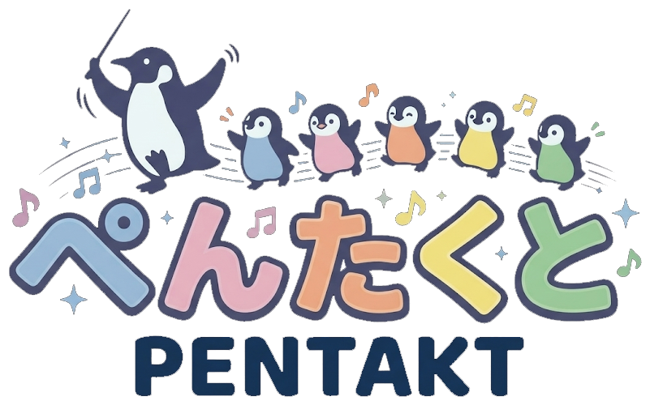

---

説明資料：https://takebayashinaoya.github.io/PENTAKT_Portfolio.github.io/  
紹介動画：https://youtu.be/0BpBAXA8obM?si=zHEJdHoWoKM-CmD1  
ソースコード：https://github.com/TakebayashiNaoya/ProjectBeast  

---

## 自己紹介
### 氏名：竹林尚哉（たけばやしなおや）
 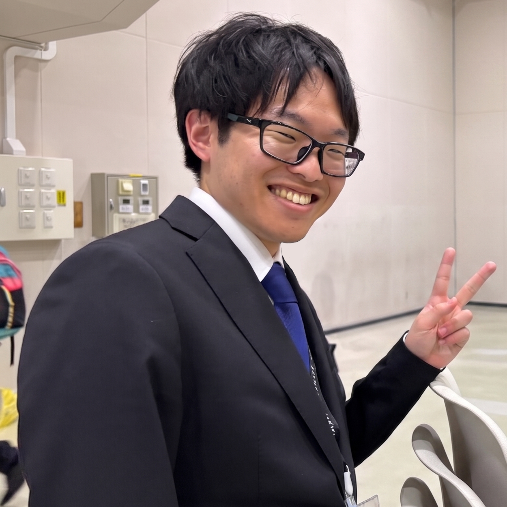

本校に入学する前は、3年間溶接工として働いておりました。  
将来のキャリアを考えたとき、やはり好きなことを仕事にしたいと考え、ゲームプログラマーを目指すようになりました。
 

**趣味** : ドライブ、旅行  
**特技** : 溶接  
**休日の過ごし方** : 積みゲーの消化、ネッ友とゲーム  
**好きなゲームジャンル** : MMO、FPS、RPG、謎解き、サンドボックス、レース  
**最近遊んだゲーム** : サブノーティカ2、リズム天国、スターフォックス

**長所** :   
- **行動力** : 何をするにしても動き出しが速く、躊躇いがありません。試行回数が増える分、リカバリーも速いです。
- **正直者** : 言い訳や嘘をつくのが嫌い（できない）です。そのため、前職でも信用して仕事を任せていただいていました。
- **大体なんとかできる** : 時間がなくても大体なんとかできます。前職では「間に合わないはありえない」と口癖のように言われてきました。そのような環境に身を置いたことで、「間に合わない」のではなく「間に合わせようとしていない」だけだと気付きました。それ以降、緊急の仕事が舞い込んできても、きちんと期日までに終わらせてきました。

## 目次

- [1. プロジェクト概要](#1-プロジェクト概要)
  - [作品概要](#作品概要)
  - [ゲーム内容](#ゲーム内容)
  - [担当ソースコード](#担当ソースコード)
- [2. Physics実装](#2-physics実装)
  - [GhostBody](#ghostbody)
  - [CharacterController](#charactercontroller)
- [3. グラフィックス・レンダリング実装](#3-グラフィックスレンダリング実装)
  - [レンダリングパイプライン](#レンダリングパイプライン)
  - [PBRレンダリング](#pbrレンダリング)
  - [シャドウ（カスケードシャドウマップ）](#シャドウカスケードシャドウマップ)
  - [キャラクターのアウトライン](#キャラクターのアウトライン)
  - [ポストエフェクト（ブルーム）](#ポストエフェクトブルーム)
  - [トーンマップ](#トーンマップ)
  - [コンピュートシェーダー（海・渦潮）](#コンピュートシェーダー海渦潮)
  - [地形システム](#地形システム)
  - [SDFフォント](#sdfフォント)
  - [動画再生システム](#動画再生システム)
  - [サブカメラ（小窓描画）](#サブカメラ小窓描画)
- [4. ゲームプレイシステム実装](#4-ゲームプレイシステム実装)
  - [陣形システム](#陣形システム)
  - [ウルトシステム](#ウルトシステム)
  - [陣形UI](#陣形ui)
  - [レベルアップ演出](#レベルアップ演出)
  - [フィーバータイム](#フィーバータイム)
  - [ゲームカメラ（躍動感と酔い対策）](#ゲームカメラ躍動感と酔い対策)
  - [ステージ選択の決定演出](#ステージ選択の決定演出)
  - [子ペンギンの察知（視界と音）](#子ペンギンの察知視界と音)
  - [経路探索（歩行可否グリッドとフローフィールド）](#経路探索歩行可否グリッドとフローフィールド)
  - [初回操作ヒント](#初回操作ヒント)
- [5. パフォーマンス最適化・その他機能](#5-パフォーマンス最適化その他機能)
  - [フラスタムカリング](#フラスタムカリング)
  - [リソースの非同期読み込み](#リソースの非同期読み込み)
  - [ディザリング](#ディザリング)
  - [危険矢印UI](#危険矢印ui)
  - [足跡デカールとディスクリプタヒープの上限](#足跡デカールとディスクリプタヒープの上限)
  - [ロード時間の短縮（時分割ロードとシェーダーキャッシュ）](#ロード時間の短縮時分割ロードとシェーダーキャッシュ)
  - [GPUデバイスロストの原因調査（DRED）](#gpuデバイスロストの原因調査dred)
- [6. 開発プロセス・ボツ案](#6-開発プロセスボツ案)
  - [未使用機能](#未使用機能)
  - [ボツにした機能](#ボツにした機能)

---

## 1. プロジェクト概要

### 作品概要

| 項目 | 内容 |
|------|------|
| タイトル | ぺんたくと |
| 制作人数 | 4人 |
| 製作期間 | 2026年2月～現在 |
| ゲームジャンル | 3Dアクション |
| プレイ人数 | 1 |
| 対応ハード | PC (Windows 11) / Xbox コントローラー |
| 使用言語 | C++ |
| エンジン | BeastEngine（学校内製エンジン（k2EngineLow） / DirectX12） |
| 使用ツール | Visual Studio 2026<br>Visual Studio CodeAdobe<br>Photoshop 2026<br>3dsMax 2026<br>Effekseer<br>GitHub<br>Fork |
| GitHub URL | [https://github.com/TakebayashiNaoya/ProjectBeast](https://github.com/TakebayashiNaoya/ProjectBeast) |
| YouTube URL | [https://youtu.be/rVx5o2Aue9Y](https://youtu.be/rVx5o2Aue9Y) |

### ゲーム内容

親ペンギンを操作し、制限時間内に子ペンギンを集めたり、アチーブメントを達成することで、ハイスコアを狙うゲームです。  
個性的な子ペンギンたちに、煩わしさや可愛らしさを感じられるゲームを目指しました。

 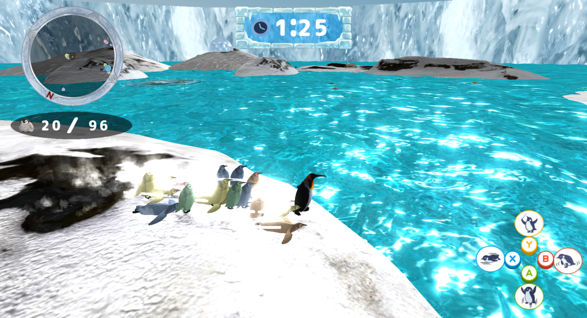
 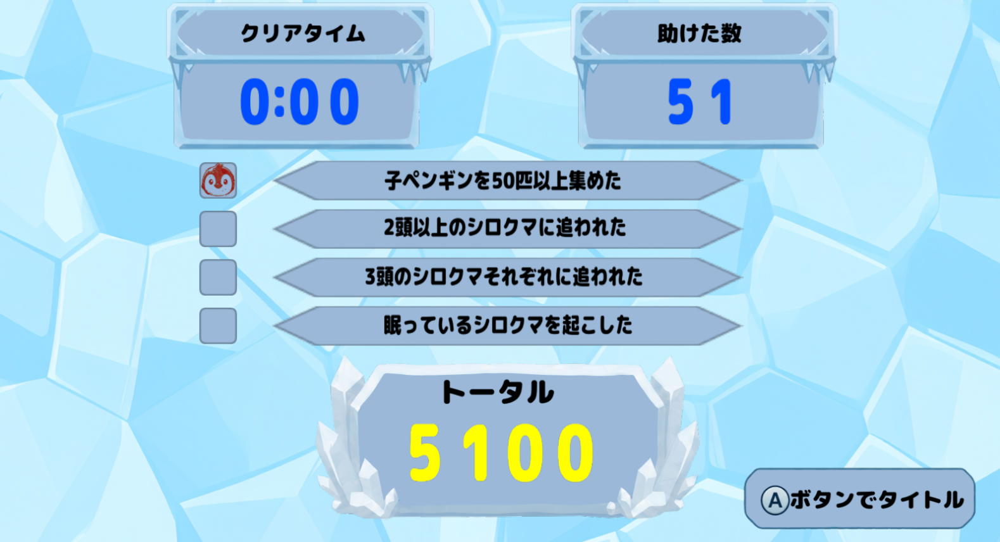

[⇑目次に戻る](#目次)

### 担当ソースコード

<details>
<summary>エンジン（BeastEngine）</summary>

- BeastEngine/
  - Geometry/
    - Frustum (.cpp / .h)
    - TriangleCuller (.cpp / .h)
  - Graphics/
    - Camera/
      - CameraSystem (.cpp / .h)
      - SubCameraManager (.cpp / .h)
    - Effect/
      - BeastEffectEmitter (.cpp / .h)
    - Font/
      - SDFFontEngine (.cpp / .h)
    - Light/
      - HemisphereLight (.cpp / .h)
      - PointLight (.cpp / .h)
      - SceneLight (.cpp / .h)
      - SpotLight (.cpp / .h)
    - PostEffect/
      - Bloom (.cpp / .h)
      - GaussianBlur (.cpp / .h)
      - PostEffectManager (.cpp / .h)
      - PostEffectTypes (.h)
      - RadialBlur (.cpp / .h)
      - ToneMap (.cpp / .h)
    - Shadow/
      - ShadowMap (.cpp / .h)
    - Video/
      - VideoClip (.cpp / .h)
      - VideoFrameTexture (.cpp / .h)
      - VideoPlayer (.cpp / .h)
      - VideoRender (.cpp / .h)
    - BeastMeshParts (.cpp / .h)
    - BeastModel (.cpp / .h)
    - FontRender (.cpp / .h)
    - GraphicsEnums (.h)
    - ICustomRenderer (.h)
    - IRenderer (.h)
    - ModelRender (.cpp / .h)
    - MyRenderer (.h)
    - OcclusionDitherManager (.cpp / .h)
    - RenderViewContext (.h)
    - RenderingEngine (.cpp / .h)
    - SpriteRender (.cpp / .h)
  - Nature/
    - INatureObject (.h)
    - SkyCube (.cpp / .h)
  - Physics/
    - BoundingVolume (.cpp / .h)
    - BoxCollider (.cpp / .h)
    - BroadphaseImpl (.cpp / .h)
    - BroadphaseInterface (.cpp / .h)
    - CapsuleCollider (.cpp / .h)
    - CharacterController (.cpp / .h)
    - CollisionAttr (.h)
    - DebugWireframe (.cpp / .h)
    - GhostBody (.cpp / .h)
    - GhostBodyManager (.cpp / .h)
    - GhostPrimitive (.cpp / .h)
    - ICollider (.h)
    - MeshCollider (.cpp / .h)
    - PhysicalBody (.cpp / .h)
    - Physics (.cpp / .h)
    - RigidBody (.cpp / .h)
    - SphereCollider (.cpp / .h)
    - Types (.h)
  - Resource/
    - AnimationClipResource (.cpp / .h)
    - ModelResource (.cpp / .h)
    - ResourceManager (.cpp / .h)
    - SkeletonResource (.h)
  - BeastEngine (.cpp / .h)
  - BeastEnginePreCompile (.cpp / .h)

</details>

<details>
<summary>ゲーム（Game/Source）</summary>

- Game/Source/
  - Actor/Character/Penguin/Formation/
    - Effect/
      - FormationEffectChain (.h)
      - FormationEffects (.cpp / .h)
      - IFormationEffect (.h)
    - Ult/
      - UltContext (.h)
      - UltController (.cpp / .h)
    - FormationController (.cpp / .h)
    - FormationDebugMonitor (.cpp / .h)
    - FormationRangeVisualizer (.cpp / .h)
    - Formations (.cpp / .h)
    - MasterFormationParameter (.h)
    - TerrainCircle (.cpp / .h)
  - Actor/Stage/
    - StageNavGrid (.cpp / .h)
    - TerrainObject (.cpp / .h)
  - Camera/
    - CameraController (.cpp / .h)
    - CameraSteering (.cpp / .h)
  - Effect/
    - Decal (.cpp / .h)
    - DecalManager (.cpp / .h)
    - DecalProfiler (.cpp / .h)
  - GameLog/
    - GameLogManager (.cpp / .h)
  - Graphics/
    - PBRParameter (.cpp / .h)
    - PBRStatus (.cpp / .h)
  - Manager/
    - FeverTimeManager (.cpp / .h)
  - Nature/
    - Ocean (.cpp / .h)
    - OceanParameter (.h)
    - Whirlpool (.cpp / .h)
    - WhirlpoolManager (.cpp / .h)
    - WhirlpoolParameter (.h)
  - Noise/
    - NoiseManager (.cpp / .h)
  - Scene/
    - EasyInGameScene (.h)
    - HardInGameScene (.h)
    - InGameSceneBase (.cpp / .h)
    - NormalInGameScene (.h)
  - UI/
    - DangerArrow/
      - DangerArrowCalc (.h)
      - DangerArrowMenu (.cpp / .h)
      - DangerArrowSystem (.cpp / .h)
    - Fever/
      - FeverIconMenu (.cpp / .h)
    - Hint/
      - InGameHintMenu (.cpp / .h)
    - FormationWheel/
      - FormationWheelMenu (.cpp / .h)
    - Menus/
      - LevelUpIconMenu (.cpp / .h)
      - TutorialMenu (.cpp / .h)
    - Model/
      - LevelUpIconAnimStatus (.cpp / .h)

</details>

<details>
<summary>シェーダー（Game/Assets/shader）</summary>

- Game/Assets/shader/
  - PostEffect/
    - bloom.fx
    - blur.fx
    - kawaseBloom.fx
    - radialBlur.fx
    - toneMap.fx
  - debugWireFrame.fx
  - DeferredLighting.fx
  - DeferredLighting_cav_register.h
  - DeferredLighting_srv_uav_register.h
  - DrawVolumeLight.fx
  - FormationRange.fx
  - IBL.h
  - LinearFillGauge.fx
  - model.fx
  - model_srv_uav_register.h
  - ModelVSCommon.h
  - Ocean.fx
  - OceanWaveCS.hlsl
  - outline.fx
  - RenderToGBuffer.fx
  - Sampler.h
  - Shadow.h
  - shadowMap.fx
  - SDFFont.fx
  - SkyCubeMap.fx
  - sprite.fx
  - Terrain.fx
  - toon.fx
  - Whirlpool.fx

</details>

<details>
<summary>パラメーター（Game/Assets/parameter）</summary>

- Game/Assets/parameter/
  - character/penguin/formation/
    - FormationParameter.json
    - FormationSwitchTuning.json
  - fever/
    - feverParameter_Easy / _Normal / _Hard (.json)
  - Graphics/
    - PBRParameter.json
  - nature/
    - oceanParameter_Easy / _Normal / _Hard (.json / .bin)
    - whirlpoolParameter_Easy / _Normal / _Hard (.json / .bin)
  - Tutorial/
    - Tutorial.json（あそびかた画面）
  - UI/fever/
    - FeverIcon.json
  - UI/hint/
    - InGameHint.json
  - UI/formationWheel/
    - FormationWheel.json
    - FormationWheelTuning.json
  - UI/levelUp/
    - LevelUpIcon.json

</details>

[⇑目次に戻る](#目次)

---

## 2. Physics実装

### GhostBody

BulletPhysicsには、物理的に押し返さず重なりだけを検知する `btGhostObject` という仕組みがあります。  
攻撃のダメージ判定や敵の索敵範囲など、**「すり抜けるが、接触だけ検知したい」** 処理にはこれが適しています。  
しかし `btGhostObject` をゲームコードから直接扱うと、生成・破棄のタイミング管理や衝突属性のフィルタリング、判定後の通知といった処理をすべてバラバラに書く必要があり、コードが煩雑になることがわかりました。  
そこで `btGhostObject` をラップし、これらをまとめて管理する **`GhostBody`** システムを自作しました。  
また、`GhostBody` の形状として使用している `CapsuleCollider` / `BoxCollider` / `SphereCollider` / `MeshCollider` といったコライダークラスも自作していますが、これらはUnityの同名クラスを意識した命名にしています。  
チームメンバーが役割をすぐに把握できるよう、あえて既存エンジンと揃えました。

#### 1. BVHによる広域判定で計算量を削減

 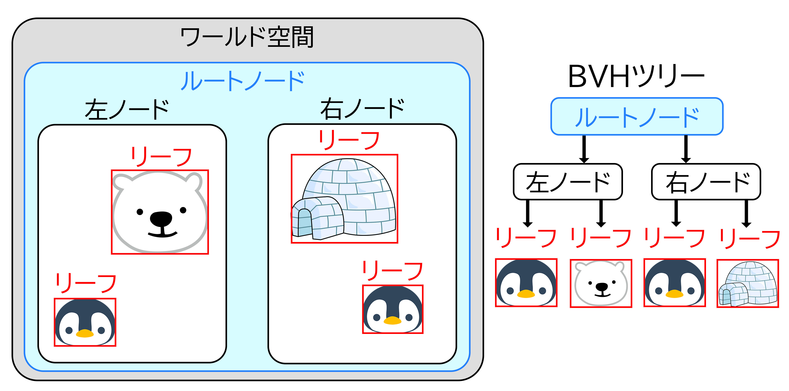

すべての GhostBody 同士をO(n²)で調べると、オブジェクト数が増えたときに処理落ちしてしまいます。  
そこで判定を2段階に分けました。  
1段階目は 広域判定（Broadphase） で、BVH（Bounding Volume Hierarchy）の一種であるDynamic AABB Tree（btDbvt）を使って **「近くにいる可能性があるペア」** だけを絞り込みます。  
各 GhostBody をAABBで包んでツリー構造に登録しておくことで、ツリーを再帰的に辿るだけで遠いペアをまとめて除外でき、O(n²)の総当たりを避けられます。  
2段階目の詳細判定に進む前にも、両者の包含球（BoundingRadius）の半径の和と距離を比較して届いていなければ即スキップする早期リターンを挟み、重い計算が走るケースをさらに減らしています。

#### 2. ビット演算による衝突属性の管理

オブジェクトの種類が増えると「誰と誰が当たるか」の管理が煩雑になります。  
これを解決するため、各 `GhostBody` に **Attribute**（自分の種別）と **Mask**（当たりたい相手の種別）をビットフラグで持たせました。  
`(a->GetMask() & b->GetAttribute()) && (b->GetMask() & a->GetAttribute())` という1行で相互フィルタリングが完結するようにし、新しい種別を追加しても既存の判定ロジックに手を加える必要がないようにしました。

#### 3. GhostBodyの登録・解除を自動化

`GhostBody` の生成タイミングと `GhostBodyManager` への登録タイミングがずれると、判定漏れやダングリングポインタの原因になります。  
これを防ぐため、**`CreateCore()` 内で `GhostBodyManager::AddBody()` を呼んで自動登録し、デストラクタで `RemoveBody()` を呼んで自動解除**する設計にしました。  
形状データも `std::unique_ptr<IGhostShape>` で保持し、形状を差し替えた際の古いメモリ解放も自動で行われるようにしました。

#### 4. 判定と後処理の分離

衝突判定のループ内でダメージ処理や座標変更を直接行うと、同一フレームで複数回ヒットが検出された際に処理の二重適用が起きるリスクがあります。  
そこで `GhostBodyManager` 内では**当たったペアの情報をコールバック（`registerPairCallback_`）として外部に通知するだけ**にとどめ、具体的な後処理は呼び出し側で行う設計にしました。  
これにより判定フェーズと処理フェーズを明確に分離し、順序依存のバグが起きにくくしました。

[⇑目次に戻る](#目次)

---

### CharacterController

キャラクターが壁や床と正しく衝突しながら移動できるよう、**`CharacterController`** を自作しました。  
なお、`CharacterController` や内部で使用している `CapsuleCollider` / `RigidBody` / `RaycastHit` といったクラス名は、Unityの同名クラスを意識した命名にしています。チームメンバーがUnityの知識を持っていることが多いため、役割をすぐに把握できるよう、あえて既存エンジンと揃えました。  
カプセル形状のコライダーと `btRigidBody` を組み合わせて物理空間に参加させており、移動の解決はすべて自前のロジックで行っています。

#### XZ移動：壁沿いスライド

 

XZ平面の移動では、**Sweep Test**（形状を空間上でスライドさせてどこで衝突するかを調べる処理）を使って壁との接触を検出します。  
壁に当たった場合は、移動ベクトルから壁の法線方向の成分を打ち消すことで、**壁に沿ってスムーズに滑る**動きを実現しています。  
また、コーナーに挟まってキャラクターがスタックしないよう、この処理を複数回繰り返す**反復スライディング解決**を採用しています。

#### Y移動：重力・接地・海面追従

垂直方向は毎フレーム重力加速度を加算し、下向きにスイープテストを行うことで床への接地を判定します。  
同様に上向きのスイープテストで天井との衝突も検出しており、ジャンプ中に天井に頭をぶつけると垂直速度がリセットされます。  
また、`SetSeaLevel()` で海面の高さを渡すことで、**キャラクターが海面より下に沈まない**ようにしています。  
泳ぎ状態に切り替わると重力をOFFにし、波面の高さに追従する動きへとシームレスに切り替わります。

#### テレポート対応

`RequestTeleport()` を呼ぶと、次の `Execute()` で**衝突判定を一切行わずに目標座標へ瞬間移動**します。  
これにより、ステージの切り替えやリスポーン処理など、強制的に座標を変えたい場面でも安全に対応できるようにしました。

[⇑目次に戻る](#目次)

---

## 3. グラフィックス・レンダリング実装

### レンダリングパイプライン

#### フォワードレンダリング

まず最初にフォワードレンダリングのみで実装しました。  
しかし、ライトの数が増えると、画面に映っていないピクセルに対してもライティング計算が走るため、  
**将来的にライトが増えた際に処理が重くなる**という問題がありました。  
それを解決するために、後述するディファードレンダリングも実装しました。  
また、フォワードとディファードを両方実装することで**それぞれの特性を比較・理解する**という学習目的もありました。

#### ディファードレンダリング

フォワードレンダリングの問題を解決するため、またフォワードとの違いを学ぶため、ディファードレンダリングを実装しました。
ディファードレンダリングでは、まずジオメトリパスで各オブジェクトの情報を **GBuffer** に書き込みます。

| GBufferスロット | 内容 |
|---|---|
| アルベド | オブジェクトの色・深度 |
| 法線 | ワールド空間の法線ベクトル |
| メタリックスムース | PBRパラメータ（metallic / smooth / ライト倍率） |

その後、ライティングパスでGBufferを参照して**画面全体に対して1回だけ**ライティング計算を行います。  
これにより、将来的にライトの数が増えても処理コストが抑えられます。  
メタリックスムースの枠には、もともとスペキュラーマップを入れていましたが、後述するPBRに差し換えました。

#### フォワード＋ディファード ハイブリッド構成

ディファードレンダリングには**半透明オブジェクトの描画が苦手**という欠点があります。  
GBufferは1ピクセルにつき1つの情報しか持てないため、複数の半透明レイヤーを正しく合成できません。  
そこで、以下のようなハイブリッド構成にしました。

- **不透明オブジェクト** → ディファードレンダリングで描画
- **半透明オブジェクト・スカイキューブ等** → フォワードレンダリングで描画

オブジェクトはそれぞれ `m_deferredModelList` / `m_forwardModelList` に振り分けられ、描画パスが切り替わります。
`SetForwardRendering(true)` を呼ぶことで、モデル単位でフォワード描画に切り替えることができるようにしました。

[⇑目次に戻る](#目次)

---

### PBRレンダリング

| PBRなし | PBRあり |
| ------- | ------- |
|  |  |

見た目のクオリティを上げるため、**PBR（物理ベースレンダリング）** を実装しました。

PBRは現実の光の物理法則に基づいてライティングを計算する手法です。  
金属・非金属の質感を統一されたパラメータで表現できるため、リアルな見た目を実現することができました。

実装には以下のモデルを使用しています。

- **拡散反射**：正規化Lambertモデル + フレネル補正による拡散反射量の調整
- **鏡面反射**：Cook-Torranceモデル（GGX法線分布・幾何減衰・フレネル反射）
- **パラメータ**：metallic（金属度）/ smooth（滑らかさ）をGBufferに書き込み、ディファードライティングパスでまとめて計算

また、モデルごとに `PBRParam` を設定することで、ディレクションライト強度・環境光強度・metallicオフセット・smoothオフセットを個別に調整できるようにしました。
jsonを用いることで、プログラマー以外の方でも簡単に調整できるようにしています。

```c++
[
  {
    "name": "Dummy",
    "comment1": "dirLightScale(0.0〜∞): ディレクションライト強度倍率 （直接光が完全に消える（影側と同じ明るさになる）、1.0：デフォルト（SceneLightで設定した色そのまま）、2.0以上：白飛びに注意）",
    "dirLightScale": 1.0,
    "comment2": "ambientScale(0.0〜∞): 環境光強度倍率 （0.0：環境光なし（影側が真っ黒になる）、1.0：デフォルト、大きくするほど：影側が明るくなりフラットな見た目に近づく）",
    "ambientScale": 1.0,
    "comment3": "metallicOffset(-1.0〜1.0): メタリックオフセット （低いほど：非金属的になり、鏡面反射が白に近づく、0.0：デフォルト、高いほど：金属的な見た目になり、鏡面反射がアルベドカラーに近づく）",
    "metallicOffset": 0.0,
    "comment4": "smoothOffset(-1.0〜1.0): スムーズオフセット （低いほど：表面が粗くなり拡散反射が支配的になる（雪・布的）、0.0：デフォルト、高いほど：表面が滑らかになり鏡面反射が鋭くなる（金属・水面的））",
    "smoothOffset": 0.0
  },
  {
    "name": "igloo",
    "dirLightScale": 0.5,
    "ambientScale": 1.5,
    "metallicOffset": 1.0,
    "smoothOffset": 1.0
  }
]
```

[⇑目次に戻る](#目次)

---

### シャドウ（カスケードシャドウマップ）

影がないとオブジェクトが地面から浮いて見えてしまうため、**カスケードシャドウマップ（CSM）** を実装しました。  
ディレクションライトから見た深度をシャドウマップに書き込んでおき、ライティング時にその深度と比較することで、光が遮られているピクセルを判定します。

#### 1枚のシャドウマップでは足りなかった

最初は1枚のシャドウマップで実装しましたが、テクセルの総数が決まっているため、**「遠くまで影を出す」と「影が精細」が両立しない**という問題がありました。  
本作のステージは広く、影を出す距離を12000ユニットまで伸ばす必要がある一方で、そうするとプレイヤーの足元の影が階段状にガタガタになってしまいます。

そこで、カメラの視錐台を距離で3分割し、区間ごとに専用のシャドウマップを持つカスケード方式にしました。  
近景は狭い範囲を1枚で覆うため精細になり、遠景は粗くても画面上では小さいので目立ちません。

| 項目 | 設定 |
|---|---|
| カスケード数 | 3 |
| 解像度 | 2048×2048（1カスケードあたり） |
| フォーマット | R32_FLOAT（深度のみ） |
| 影を出す距離 | 12000ユニット（デバッグUIで変更可） |
| フィルタリング | 3×3 PCF |

#### 1. 分割位置は対数分割と等分割の混合

対数分割は手前を細かく配れますが、そのままだと近景の区間が極端に狭くなりすぎます。  
逆に等分割だと近景の区間が広くなりすぎて、キャラクターの影が粗くなります。  
そこで両者を係数で混ぜる **Practical Split Scheme** を採用し、手前を細かく・奥を粗く配る配分を1つのパラメーターで調整できるようにしました。

```c++
// 0.0で等分割、1.0で完全な対数分割
constexpr float CASCADE_SPLIT_LAMBDA = 0.85f;

const float logSplit     = nearZ * powf(farZ / nearZ, p);
const float uniformSplit = nearZ + (farZ - nearZ) * p;

m_cascadeFarDistances[i] =
    CASCADE_SPLIT_LAMBDA * logSplit + (1.0f - CASCADE_SPLIT_LAMBDA) * uniformSplit;
```

#### 2. 外接球＋テクセルスナップで影のちらつきを消す

各カスケードは、担当区間の視錐台に**外接する球**へ直交投影を合わせています。  
AABBで囲むとカメラが回転するたびに覆う範囲が伸縮し、影の輪郭がちらついてしまいますが、球であればカメラが回っても大きさが変わりません。

それでもカメラが移動すると、シャドウマップの升目とワールドの位置関係が毎フレームずれ、影の輪郭が細かく揺れます。  
これを消すため、**覆う範囲の中心をライト空間で1テクセル単位に丸める**処理を入れました。  
このとき丸めの基準となるライト空間はワールド原点を基準に作っています。カメラ追従の点を基準にすると物差し自体が毎フレーム動いてしまい、丸めてもちらつきが消えませんでした。

#### 3. キャスターのカリングは「球」ではなく「箱」で行う

影を落とす側（キャスター）は、カメラの視錐台ではなく**そのカスケードが覆う範囲**でカリングします。  
カメラから見えないオブジェクトでも、画面内へ影を落とすことがあるためです。

このとき、覆う範囲を球のまま判定すると影が点滅するバグが発生しました。  
直交投影が実際に覆うのは一辺 `半径×2` の正方形で、隅は中心から半径の √2 倍まで届きます。  
そのため球で弾くと、受け手は影を受ける範囲なのにキャスターだけが除外され、カメラが動くたびに影が消えたり出たりしてしまいます。  
キャスターのAABBをライト空間へ変換し、**箱同士の交差**で判定するよう修正しました。  
奥行き方向については、範囲より手前（ライト側）にあるものも中へ影を落とすため、近クリップ側に取ってある余裕のぶんまで対象に含めています。

同じ理由で、地形チャンクをゲーム側でカメラの視錐台カリングにかけるのもやめました。  
画面外のチャンクがキャスターからも外れてしまい、カメラを回すたびに地形の影が消える不具合が出たためです。  
現在は**描画側のカリングは `RenderingEngine`、影側のカリングは `ShadowMap`** がそれぞれの範囲で行う責務分けにしています。

#### 4. 受け手側の処理を1つのヘッダーに集約

影を受ける側はディファードライティングだけでなく、海（`Ocean.fx`）や渦潮（`Whirlpool.fx`）にも必要でした。  
同じ処理を3箇所に書くと片方だけ直して見た目がずれるため、判定処理を `Shadow.h` に切り出して共通化しています。  
シェーダーごとにシャドウマップとサンプラーのレジスタ番号が違うため、グローバル変数を直接参照せず引数で受け取る形にしました。

判定は**手前のカスケードから順に試し、範囲内に入った最初のもので確定**します。  
カメラからの距離でカスケードを選ぶ方式もありますが、この方式なら受け手側がカメラ座標を持っていなくても使えます。  
カスケードの端はPCFの参照が範囲外へはみ出すため、少し内側で「このカスケードでは判定できない」と扱い、次のカスケードへ送るようにしています。

輪郭のジャギは3×3のPCF（周囲9テクセルの平均）で緩和し、シャドウアクネ（自己遮蔽による縞模様）は深度バイアスで抑えています。

#### 5. 抜き・フェード中のモデルが四角い影を落とさないようにする

シャドウマップへの書き込みは深度専用シェーダー（`shadowMap.fx`）で行いますが、頂点レイアウトと定数バッファをGBufferパス（`RenderToGBuffer.fx`）と揃えることで、同じtkmモデルをそのまま流せるようにしました。スキニング・インスタンシング描画にも対応しています。

このとき、**GBufferパスとまったく同じ `clip()` 判定を影パスでも行う**必要がありました。

- **アルファカットアウト**：草や柵などテクスチャで抜いた部分が、四角いシルエットのまま影を落としてしまう
- **モデル単位ディザリング**：フェードで消えている最中のモデルが、不透明な影を落としてしまう

#### 6. 影の濃さを決めているのは環境光だった

実装当初、影を有効にしてもほとんど見た目が変わりませんでした。  
原因は環境光で、直接光を完全に遮っても影の中が環境光で埋まってしまい、トーンマップ後にはほぼ差が見えなくなっていました。

そこで、直接光と環境光それぞれについて「影の中で何割残すか」を分けて持たせ、環境光にも影を掛けられるようにしました。

| パラメーター | 内容 |
|---|---|
| 影の中の直接光 | 0.0で直接光を完全に遮る。上げるほど影が薄くなる |
| 影の中の環境光 | 下げるほど影が濃くなる。影の見え方に最も効く |

これらの値・影を出す距離に加えて、カスケードごとの担当区間と1テクセルあたりのワールドサイズ（影の粗さの目安）も、ImGuiのデバッグUIから実行中に確認・調整できるようにしています。

[⇑目次に戻る](#目次)

---

### キャラクターのアウトライン

流氷原は白い氷と淡い水色の海でできているため、白黒のペンギンやシロクマが背景に溶けて見失いやすいという問題がありました。そこで、キャラクターだけに**背面法線押し出し方式**の輪郭線を付けて、背景から浮き上がらせています。

#### 背面法線押し出し方式

モデルをもう一度描き、その際に頂点を法線方向へ少し押し出したうえで**前面をカリング**します。すると背面だけが単色で残り、本体の外側にひとまわり大きいシルエットが見えます。これが輪郭線になります。ピクセルシェーダーは色を返すだけです。

押し出しはワールド空間ではなく**クリップ空間のXY方向**へ行っています。ワールド空間で押し出すと、カメラから遠いキャラクターほど輪郭線が細くなって消えてしまうためです。クリップ空間で押し出したうえで `w` を掛けることで、距離によらず画面上の太さが一定になります。

#### 遠距離でモデルが輪郭線に飲み込まれる問題

ところが、画面上の太さを完全に一定にすると今度は逆の問題が出ます。遠くの小さなキャラクターでは、輪郭線の太さがモデル自体のサイズに対して相対的に大きくなりすぎ、**キャラクターが真っ黒な塊に潰れて**しまいます。ステージには常に数十体の子ペンギンがいるため、遠景がとくに目立ちました。

そこで押し出し量に**ワールド単位の上限**を設け、遠距離ではその上限のほうが小さくなるようにクランプしています。

```hlsl
const float OUTLINE_MAX_WORLD_WIDTH = 6.0f;
float widthNdc = min(outlineWidth, OUTLINE_MAX_WORLD_WIDTH * mProj._m00 / max(clipPos.w, 0.001f));
clipPos.xy += normalize(clipNormal.xy) * widthNdc * clipPos.w;
```

近距離では指定した太さがそのまま使われ、遠距離ではワールド単位の上限側が勝って輪郭が細くなります。結果として「近くでははっきり縁取られ、遠くでは潰れない」挙動になりました。

#### スキニング対応

キャラクターはアニメーションするため、スキニング用の頂点シェーダーも用意しています。こちらはスキン行列にワールド変換が含まれているので `mWorld` を掛けず、法線もスキン行列で変換します。本体の描画とまったく同じ変形を通さないと、輪郭線だけがモデルからずれてしまいます。

#### トゥーンから切り離してディファードに載せる

輪郭線のシェーダー自体はもともとトゥーンシェーディングの一部として実装したもので、**トゥーンを有効にしないと輪郭線も使えない**構造でした。しかし今作のアートスタイルにはトゥーンの陰の段差が合わず、輪郭線だけが欲しい状況でした。

そこで `ModelRender` に「本体は通常のディファードで描いたまま、輪郭線だけをフォワードパスで重ね描きする」経路を追加しました。輪郭線用モデルの初期化をトゥーン経路から切り出し、レンダリングエンジン側に輪郭線専用の描画リストを持たせています。呼び出す側は `EnableOutline()` を呼ぶだけで、ライティングやポストエフェクトは通常どおり効きます。

太さと色はキャラクターごとに設定でき、子ペンギンと親ペンギンは細め（0.002）の濃い紺、シロクマは体が大きいぶん少し細く（0.0018）、やや明るい紺にしています。真っ黒にすると絵本調の見た目から浮くため、背景の氷の色に寄せた紺を選びました。

[⇑目次に戻る](#目次)

---

### ポストエフェクト（ブルーム）

| ブルームなし | ブルームあり |
| ------- | ------- |
|  |  |

見た目のクオリティをさらに上げるため、**ブルーム**を実装しました。  
これにより、海の鏡面反射がキラキラと輝いて見えるようになりました。  
海のシェーダーでは、スペキュラ値をHDR（1.0を超える値）として出力し、ブルームとの相性を良くしています。

#### 処理フロー

1. **輝度抽出**：メインレンダリングターゲットから、しきい値を超える明るいピクセルだけを抽出
2. **ブラー**：抽出した輝度テクスチャにブラーをかけてぼかす
3. **加算合成**：ぼかした結果をメインレンダリングターゲットに加算合成

ブルームの種別は以下の2種類から切り替えられます。

| 種別 | 内容 |
|---|---|
| 通常ブルーム | 輝度テクスチャを1段ブラーして合成 |
| 川瀬式ブルーム | 解像度を段階的に半分に縮小しながら最大4段ブラーして平均合成。より広い発光表現が可能 |

ブラーの種別も**平均ブラー**と**ガウシアンブラー**から選択できます。
ガウシアンブラーは中心に近いほど重みが大きく、より自然なぼけを実現します。

[⇑目次に戻る](#目次)

---

### トーンマップ

メインレンダリングターゲットは `R32G32B32A32_FLOAT` のHDRバッファで、海のスペキュラなど1.0を超える明るさをそのまま保持しています。  
しかし最終的な出力先は0〜1しか表現できないため、そのまま出すと明るい部分が白一色に潰れてしまいます。  
これを解決するため、HDRをLDRの範囲へ圧縮する**トーンマップ**を実装しました。

#### 5つの方式を実装して見比べられるようにした

方式ごとに圧縮カーブが違い、どれが本作の絵に合うかは実際に見比べないと判断できません。  
そこで方式をピクセルシェーダーのエントリーポイントで分け、実行中に切り替えられるようにしました。

| 方式 | 内容 |
|---|---|
| enNone | トーンマップなし（比較用の基準） |
| enExposure | 露出を掛けてクランプするだけ。圧縮カーブが無いためすぐ飽和する |
| enReinhard | `x / (1 + x)`。全域をなだらかに圧縮する基本形 |
| enReinhardExtended | ホワイトポイント付き。指定した輝度をきちんと純白まで持ち上げられる |
| enACES | 映画的なフィルミックカーブ（Krzysztof Narkowiczによる近似式）。中間調を大きく持ち上げる |
| enUncharted2 | John Hableによるフィルミックカーブ。暗部が締まりコントラストが出る |

見比べた結果、本作では雪原と海の明るい部分が素直に収まる **enReinhard** を採用しました。

#### RGBベースではなく輝度ベースで適用する

各方式は「RGBベース」と「輝度ベース」の2通りで適用できるようにしています。

RGBベースは各チャンネルを独立に圧縮するため、明るいチャンネルほど強く潰れて3チャンネルが互いに近づき、**明部の色が白へ抜けてしまいます**（実測でReinhardの明部の彩度が0.001まで低下しました）。  
輝度ベースは色比を保ったまま輝度だけを圧縮するので彩度が残るため、既定はこちらにしています。

```hlsl
// 輝度ベースでは色比 exposedColor/luminance を保ったまま、輝度だけを圧縮後の値へ置き換える
if (isLuminanceBased > 0.5f)
{
    return exposedColor * (curvedLum / GetLuminance(exposedColor));
}
return curvedRgb;
```

#### 方式ごとに既定の露出を持たせる

圧縮カーブが方式ごとに違うため、適正な露出も方式ごとに変わります。  
同じ露出のまま方式だけ切り替えると全体の明るさが大きく変わってしまい、カーブの違いを比較できません。  
そこで**トーンマップ無しの平均輝度を基準に方式ごとの適正露出を実測し、切り替え時に既定値として自動適用**するようにしました（enReinhardは2.6、enACESは1.0など）。

#### 2パス構成

同一のレンダリングターゲットを読みながら書くことはできないため、専用RTを経由する2パス構成にしました。

```
[メインRT（HDR）] → トーンマップPS → [トーンマップ専用RT] → 書き戻し → [メインRT]
```

書き戻し時のフォーマット変換を避けるため、専用RTはメインRTと同じ設定で作成しています。  
書き戻し自体は単純なコピーなので、既存のスプライトシェーダーを流用しました。

#### 実行中に方式を切り替えるための工夫

ピクセルシェーダーはPSOに焼き込まれるため、描画時に選べるのは**あらかじめ作ってあるスプライトだけ**です。  
そこで初期化時に全方式ぶんのスプライトをまとめて生成しておき、描画時に `EnToneMapType` で添字を引いて選ぶ構成にしました。  
露出やホワイトポイントなどのパラメーターは `Sprite` が描画のたびに定数バッファを再アップロードするため、ImGuiのスライダーを動かすと即座に反映されます。

#### 実行順序

ブルームの輝度抽出はHDRのまま行う必要があるため、**ブルーム → トーンマップ**の順で実行します。  
逆にすると1.0を超える値が先に潰れてしまい、しきい値を超えるピクセルがほとんど抽出できなくなります。  
また、エフェクト（Effekseer）はポストエフェクトより前に描画することで、ブルームとトーンマップの対象に含めています。

サブカメラ（小窓）のビューにも同じ方式のトーンマップを適用しています。  
小窓だけHDRのまま出すとメイン画面と色味が合わないためで、ブルームは掛けずトーンマップのみで揃えることで描画コストを抑えました。  
方式の定数は `RenderingEngine` 側で一箇所にまとめており、片方だけ書き換えて色味がずれることを防いでいます。

#### ガンマ補正について

現状バックバッファは `R8G8B8A8_UNORM`（非sRGB）で、リニア色をエンコードせずそのまま出力しています。  
シェーダー側でsRGBエンコードを掛けるフラグも用意していますが、有効にすると物理的には正しくなる一方で画面全体が大きく明るくなり、ライト強度とマテリアルの全面的な再調整が必要になるため、既定ではオフにしています。

[⇑目次に戻る](#目次)

---

### コンピュートシェーダー（海・渦潮）

#### 海

 

海はC++で動的にグリッドメッシュを生成し、頂点を波のように動かすことでリアルな海面を表現しています。

グリッドの分割数は **128×128** で、頂点数は約17,000個になります。  
これらすべての頂点の波高さを毎フレームCPUで計算すると処理負荷が高くなるため、**コンピュートシェーダー**でGPU並列処理を行うようにしました。

 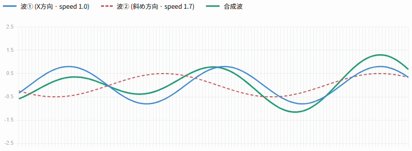

波の計算は2本のsin波を重ねた式で行います。

- **波①**：X方向（speed倍率 1.0）
- **波②**：斜め方向（X:0.6, Z:0.8、speed倍率 1.7）

スレッドグループは `(8, 8, 1)` でディスパッチし、各スレッドが1頂点の波高さを `RWStructuredBuffer` に書き出します。  
CPUにReadbackした波高さキャッシュは、チャンクAABBの構築にも活用しています。

頂点シェーダー側でも同じ数式で波高さを計算し、隣接点との差分近似で法線を再構築しています。

海もjsonでパラメーター調整できるようにしています。
```c++
[
	{
		"baseReflectance": 0.0,   // 基本反射率
		"wave1Amplitude": 5.0,    // 波①の振幅
		"wave1Frequency": 0.025,  // 波①の空間周波数
		"wave2Amplitude": 2.0,    // 波②の振幅
		"wave2Frequency": 0.06,   // 波②の空間周波数
		"specularPower": 50.0,    // スペキュラのPhong指数（大きいほどハイライトが絞られる）
		"specularScale": 0.5,     // スペキュラ強度の倍率（0.0で照り返しを消せる）
		"ambientScale": 2.0       // 海専用アンビエント強度倍率（他オブジェクトに影響しない）
	}
]
```

#### 渦潮

 

渦潮はUV座標を中心（0.5, 0.5）基点で毎フレーム回転させることで、渦が回って見えるアニメーションを実現しました。  
また、渦潮自体も円形グリッドメッシュで構成されており、毎フレーム `Ocean::SampleWaveHeight()` を呼び出して、  
海の波高さキャッシュを参照することで、渦潮メッシュの各頂点Y座標を海面の高さに合わせています。  
これにより、渦潮が波に乗って自然に揺れているように見えます。

渦潮もjsonでパラメーター調整できるようにしています。
```c++
[
    {
        "whirlpoolRadius":      200.0,  // 渦潮の影響範囲半径
        "attractSpeed":         30.0,   // 引き寄せ速度（半径方向）
        "rotateSpeed":          3.0,    // 渦巻き回転速度（ラジアン/秒）
        "uvRotationSpeed":      1.5,    // UV回転速度（ラジアン/秒）
        "scaleChangeTime":      2.5,    // 渦潮の拡大率の変化にかかる時間
        "stayTime":             10.0,   // 渦潮の拡大率が最大値で留まる時間
        "createInterval":       2.0,    // 渦潮の生成間隔
        "orbitRadius":          80.0,   // 子ペンギンが落ち着く中心からの軌道半径
        "orbitRadiusVariation": 20.0,   // 軌道半径のランダム変動最大幅（±この値）
        "orbitOffsetVariation": 30.0,   // 個体ごとの軌道半径オフセットの最大幅（±この値）
        "rotateScaleVariation": 0.3     // 個体ごとの回転速度倍率の変動幅（1.0 ± この値）
    }
]
```

[⇑目次に戻る](#目次)

---

### 地形システム

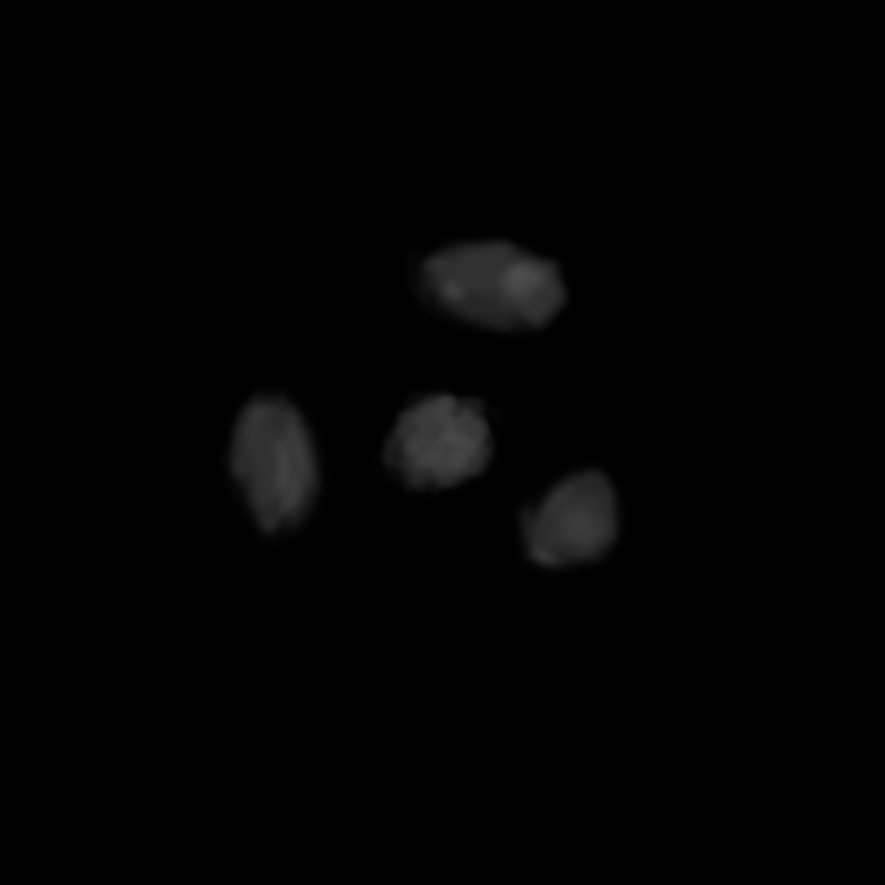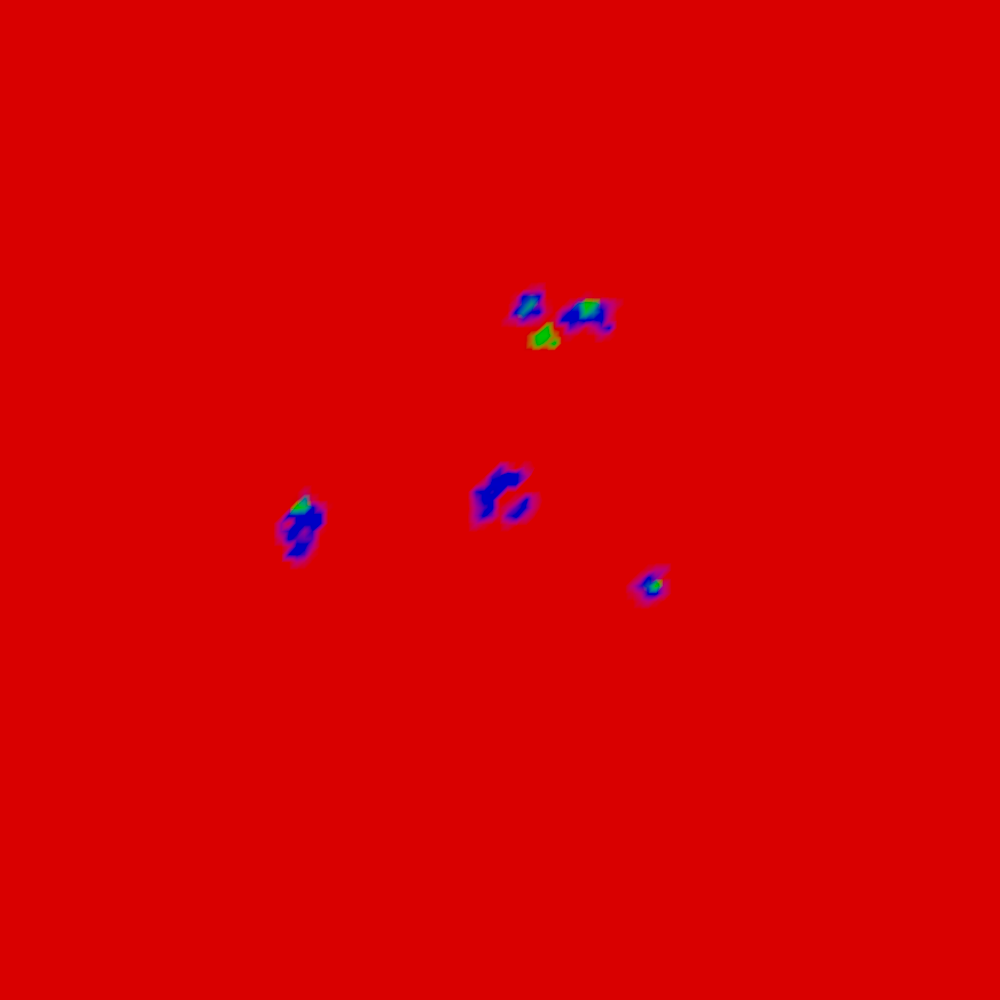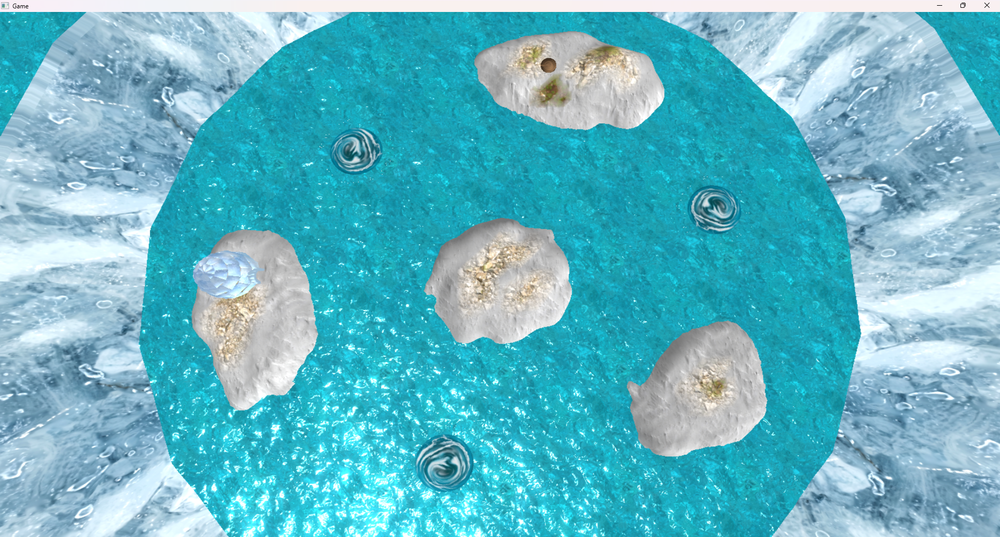

ハイトマップから地形メッシュをCPU側で動的生成し、スプラットマップで複数テクスチャをブレンドする地形システムを実装しました。

#### 1. ハイトマップからのメッシュ生成

DirectXTexライブラリでDDS（R16_UNORM形式）のハイトマップを読み込み、各ピクセルの輝度値を `pixel / 65535.0f × heightScale` でワールド高さに変換します。  
変換した高さ値を格納した頂点バッファをCPU上で構築し、`TkmFile` としてリソースバンクに登録することで、エンジンの既存描画パスにそのまま流し込むことができます。  
`subsample` パラメーターで解像度を落とすことで、ポリゴン数とクオリティのバランスを場面ごとに調整できます。

#### 2. スプラットマップによるテクスチャブレンド

地形テクスチャの塗り分けにはスプラットマップ（R=雪・G=草・B=岩）を使用しています。  
シェーダー（`Terrain.fx`）側でスプラットマップのRGB値をウェイトとして読み取り、3種のアルベドテクスチャを加重平均で合成します。  
さらに各テクスチャにノーマルマップとラフネスマップを紐付けることで、既存のPBRライティングパスが地形でも正しく機能するようにしました。

#### 3. チャンク単位のフラスタムカリング

地形全体を一枚のメッシュとして扱うと、地形が巨大な場合に描画コストが高くなります。  
そこで地形をチャンク単位（`chunkDivision × chunkDivision`）に分割し、それぞれに独立した `ModelRender` を割り当てました。  
毎フレームのフラスタムカリングでチャンクAABBと視錐台の交差判定を行い、**画面に映っているチャンクのみGPUに送る**ことで、地形の描画コストを抑えています。

#### 4. 物理コリジョン

描画用のチャンクメッシュとは別に、フルメッシュから `PhysicalBody` のコリジョンを生成しています。  
これにより、プレイヤーや子ペンギンが地形の起伏に正しく乗り上げることができます。

[⇑目次に戻る](#目次)

---

### SDFフォント

デフォルトの `Font` クラスではビットマップフォントを使用しており、拡大するとピクセルが荒れる問題がありました。  
これを解決するため、**SDF（Signed Distance Field）フォント**を実装しました。

#### 仕組み

SDF方式では、各グリフを「文字の輪郭からの距離」を格納したテクスチャ（SDFアトラス）として表現します。  
カスタムピクセルシェーダー（`SDFFont.fx`）側でこの距離値をしきい値で切り分けることで、**どの解像度・スケールでも鮮明な文字**を描画できます。

#### 実装の流れ

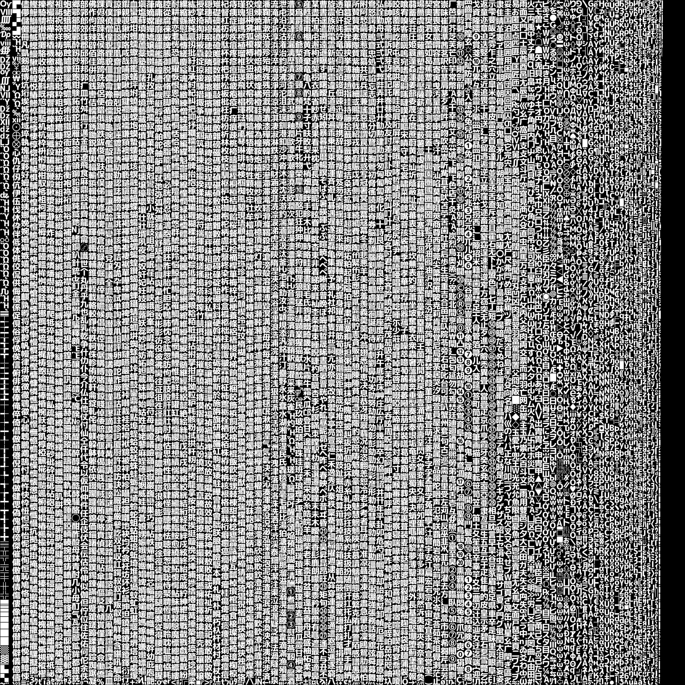

1. **アトラス生成**：`msdf-atlas-gen` ツールで使用文字のSDFアトラス（PNG）とグリフメタデータ（JSON）を事前生成
2. **グリフ読み込み**：JSONからUnicodeコードポイントをキーとするグリフ情報（アドバンス幅・UV座標・プレーン座標）をunordered_mapに展開
3. **描画**：`SpriteBatch` + カスタムPSでグリフを1文字ずつ配置・描画

テキストアライメント（左・中央・右）、行間倍率、ドロップシャドウを設定できるようにし、  
`FontRender` に差し替えるだけでゲームコードを変更せずにSDF描画へ切り替えられる設計にしました。

[⇑目次に戻る](#目次)

---

### 動画再生システム

 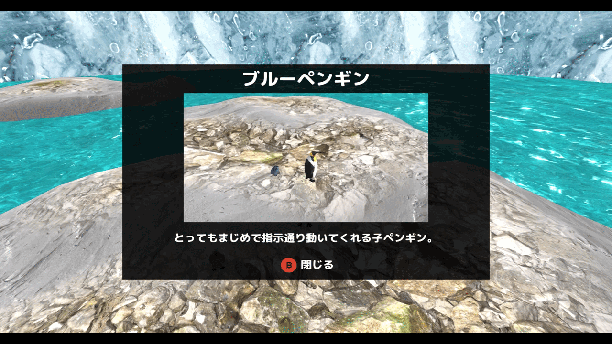

ステージセレクト画面でゲームプレイ映像を再生するため、**動画再生システム**を自作しました。

#### クラス構成

| クラス | 役割 |
|---|---|
| `VideoClip` | フレームデータの保持・デコード |
| `VideoPlayer` | 再生状態の管理（再生・停止・ループ・速度） |
| `VideoFrameTexture` | CPU→GPUへのフレームデータ転送 |
| `VideoRender` | スプライトとしての描画 |

#### 2種類のクリップ形式に対応

連番PNG（コマ撮り）とMP4の両方に対応しています。  
- **連番PNG**：全フレームをメモリに事前ロードし、インデックスで即座にアクセス
- **MP4**：Windows Media Foundation APIでストリーミングデコード。`IMFSourceReader` を `void*` で保持することでヘッダーへのWindows.hインクルードを回避

#### VideoFrameTexture：CPU→GPU転送の設計

毎フレーム画像データをGPUに転送するため、以下の2バッファ構成を採用しました。

```
[UPLOADヒープ] ← CPU書き込み → CopyTextureRegion → [DEFAULTヒープ（GPU読み取り）]
```

コマンドリスト記録中に `CopyTextureRegion` を発行し、前後にリソースバリア（`PIXEL_SHADER_RESOURCE → COPY_DEST → PIXEL_SHADER_RESOURCE`）を挟んで同期します。  
また、**前フレームと同じインデックスの場合はUploadFrameを呼ばない**ことで、不要なGPU転送を省いています。

[⇑目次に戻る](#目次)

---

### サブカメラ（小窓描画）

 

シロクマに狙われた子ペンギンを別視点で映す**ピクチャー・イン・ピクチャー**（小窓）を実装しました。

#### レンダリングパイプラインへの組み込み

`RenderViewContext` という構造体を新設し、GBuffer・レンダーターゲット・フラスタム・カメラをビュー単位でまとめて管理できるようにしました。  
`RenderingEngine` はメインカメラ→サブカメラの順に `ExecuteViewPass()` を呼び出し、**各ビューで独立した描画パスを実行**します。

```
[メインカメラ] → GBuffer → ディファードライティング → ブルーム → トーンマップ → メインRT
[サブカメラ]  → GBuffer → ディファードライティング →           トーンマップ → サブRT
                                                                                ↓
                                                                   画面上にスプライトとして合成
```

サブカメラのビューにはブルームを掛けず、メイン画面と色味を揃えるためのトーンマップだけを適用することで、描画コストを抑えています。

#### SubCameraManagerによる制御

`SubCameraManager` は `CameraSystem` に対してサブカメラの生成・破棄を指示するとともに、小窓スプライトのスライドイン・アウトアニメーションを管理します。  
ポーズ画面表示中は `SetRenderingBlocked(true)` で描画をスキップし、タイトル遷移時は `ForceEnd()` でアニメーションを省いて即時消去できるようにしました。

[⇑目次に戻る](#目次)

---

## 4. ゲームプレイシステム実装

### 陣形システム

 

親ペンギンに追従する子ペンギンたちの隊列を「陣形」として実装しました。
**円陣・密集陣・散開陣・三角陣**の4種類があり、プレイヤーは状況に応じて陣形を切り替えることで、移動速度や渦潮への耐性、隊列の広さなどが変化します。

#### IFormationによる陣形の抽象化

各陣形は `IFormation` を継承し、`CalculatePositions()` で子ペンギンの配置座標を計算します。

- **リング陣形（円陣・密集陣・散開陣）**：共通基底クラス `RingFormation` が、リング k（1始まり）に `baseFollowers*k` 体を等間隔配置するロジックを持ちます。各リングの半径は `radiusPerRing*k` となり、全リングで隣接間隔が均一になるよう設計しています。3陣形はこの基底クラスを継承し、`baseFollowers` / `radiusPerRing` などのパラメーターだけをJSONで変えることで隊列の密度を作り分けています。
- **三角陣**：ボーリングのピン配置のようにレベル1で9体を4行に並べ、レベルが上がるごとに外周を1層ずつ拡張していくアルゴリズムを実装しました。

```c++
// RingFormation::CalculatePositions（抜粋）
// リング ring（1始まり）: baseFollowers*ring 体を半径 radiusPerRing*ring に等間隔配置
for (int ring = 1; placed < count; ++ring)
{
    const int   ringCount = m_param->baseFollowers * ring;
    const float radius    = m_param->radiusPerRing * ring;
    for (int i = 0; i < ringCount && placed < count; ++i)
    {
        const float angle = startAngle + (float)i / ringCount * 2.0f * Math::PI;
        Vector3 pos = center;
        pos.x += radius * sinf(angle);
        pos.z += radius * cosf(angle);
        out.push_back(pos);
        ++placed;
    }
}
```

#### FormationControllerによるレベル管理・入隊判定・範囲の可視化

`FormationController` は4種類の `IFormation` インスタンスを配列で保持し、現在の陣形への切り替え・座標計算の委譲・陣形レベル管理（満員になったリング数）をまとめて行います。  
入隊判定半径は「最外半径 + 入隊マージン」で求まり、**ウルト発動中は陣形固有の拡大距離との大きい方を採用**することで、ウルト中だけ一時的に入隊しやすくなる演出も実現しています。

この入隊範囲を可視化するため、地形の起伏に貼り付く円 `TerrainCircle` と、それを束ねる `FormationRangeVisualizer` を実装しました。`TerrainCircle` は中心座標から `PhysicsWorld::Raycast` → `Ocean::SampleWaveHeight` の順に地表高さをサンプリングして円周上の各頂点のYを決定し、陸地でも海面でも地形に沿ったリングを描画します。  
これらは既存の `RenderingEngine` にゲーム側専用の描画クラスを差し込むための新インターフェース `ICustomRenderer` を経由して呼び出しており、エンジン側のフォワードレンダリングパスに独自メッシュ・独自シェーダー（`FormationRange.fx`）で割り込めるようにしました。

[⇑目次に戻る](#目次)

---

### ウルトシステム

#### コンポジット・ストラテジーパターンによる陣形効果の設計

陣形ごとに固有のウルト効果（速度アップ・渦潮耐性・シロクマ攻撃無効化・ペンギン呼び出しなど）を組み合わせる際、if文の羅列にならないよう、`IFormationEffect` を起点にしたコンポジット・ストラテジー構成で設計しました。

- `IFormationEffect`：`GetSpeedMultiplier()` / `HasWhirlpoolResistance()` / `Enter` / `Update` / `Exit` を持つ、効果1つ分のインターフェース
- `FormationEffectChain`：複数の `IFormationEffect` を保持し、速度倍率は全エフェクトの**乗算**、渦潮耐性は全エフェクトの**OR**で合成する
- 各 `IFormation` は「常時有効な `m_passive`」と「ウルト中のみ有効な `m_ult`」の2本のチェーンを持ち、コンストラクタで `SpeedModifierEffect` / `WhirlpoolResistanceEffect` / `PenguinCallEffect` / `BearAttackNullifyEffect` などの具体エフェクトを陣形ごとに組み合わせて登録する

```c++
// ClusterFormation（密集陣）のウルト効果の組み立て例
m_ult.AddEffect(std::make_unique<WhirlpoolSpeedBoostEffect>(&param.ultWhirlpoolBoostMultiplier));
if (param.ultBearAttackNullify)
{
    m_ult.AddEffect(std::make_unique<BearAttackNullifyEffect>());
}
m_ultVisual = std::make_unique<UltEffectCluster>();  // ウルト演出（ビジュアル）は効果と分離して所有
```

この設計により、新しい陣形やウルト効果を追加する際も既存クラスを一切変更せず、`FormationEffects.h` に効果クラスを1つ追加して陣形のコンストラクタで組み合わせるだけで済むようになっています。

#### UltControllerによる発動・タイマー管理

`UltController` はこのエフェクトチェーンと演出（`IUltEffect`、非所有ポインタ）を受け取り、発動・毎フレーム更新・クールダウン管理を担当します。効果と演出の所有権はどちらも `IFormation` 側が持ち、`UltController` は陣形切り替え時に `SetUlt()` で参照を差し替えるだけにすることで、陣形をまたいだウルトの状態遷移でも安全に破棄・切り替えができるようにしています。  
また、チャージ中（クールダウン中）とディスチャージ中（発動中）のループSEの再生・停止も `UltController` 側で状態同期しており、シーン破棄時だけでなく、それを経由しない破棄経路でも鳴りっぱなしにならないようデストラクタで明示的に停止する保険を入れています。

[⇑目次に戻る](#目次)

---

### 陣形UI

| ウルトチャージ中 | ウルト発動可能 | ウルト発動中 |
| ------- | ------- | ------- |
||  |  |

#### FormationWheelMenu：陣形切り替え・ウルトゲージの表示

画面下部に現在の陣形アイコンを中央に大きく表示し、その左右にLB/RBで切り替わる陣形アイコンを並べるUIを実装しました。切り替え中は各アイコンが横方向にスライドするアニメーションを行い（`FormationController::IsSwitchingFormation()` と連動して連続入力をロック）、LT/RTのウルトアイコンはウルト発動可能な間だけ通常色、それ以外はグレーアウトします。座標・サイズ・色などの見た目パラメーターは `FormationWheelTuning.json` からホットリロードで調整できるようにし、デザイン確認のたびにビルドし直す手間を無くしました。

#### LinearFillGauge：アイコンの形を保ったまま塗りつぶすゲージシェーダー

ウルトのクールダウンゲージには、アイコンの絵柄を保ったまま下から上へ色が塗り上がっていく表現が欲しかったため、専用シェーダー `LinearFillGauge.fx` を新規実装しました。

```hlsl
// UV.y は 0(画像の上端) 〜 1(画像の下端)。下端から g_fillAmount の割合だけ塗りつぶす
float fillLine = 1.0f - g_fillAmount;
float fillMask = smoothstep(fillLine - AA, fillLine + AA, In.uv.y);
float4 tint = lerp(g_baseColor, g_fillColor, fillMask);
float4 color = float4(tint.rgb, tint.a * texAlpha);
```

テクスチャのアルファ値（アイコンの形）はそのまま活かしつつ、UV.y方向のしきい値を `smoothstep` で滑らかにブレンドすることで、スケールを変えずにアンチエイリアスのかかった塗り分けを実現しています。BeastEngine側には対応する `LinearFillGaugeRender`（`IRenderer` 派生）を追加し、ゲーム側からは `UIParts.h` の `UILinearFillGauge` を通して他のUI部品と同じ感覚で `SetFillAmount()` を呼ぶだけで使えるようにしました。

[⇑目次に戻る](#目次)

---

### レベルアップ演出

 

陣形のリングが満員になり陣形レベルが上がった瞬間、親ペンギンの頭上にアイコンを表示する `LevelUpIconMenu` を実装しました。ワールド座標をスクリーン座標に変換して追従させつつ、上昇移動とフェードイン→待機→フェードアウトを行います。色のフェード自体は既存の `UIColorAnimation` に任せ、`LevelUpIconMenu` 側はフェードイン用アニメーションからフェードアウト用アニメーションへ差し替えるタイミング管理と移動更新だけに責務を絞ることで、既存のUIアニメーション基盤を再利用しつつ演出固有のロジックを薄く保っています。

[⇑目次に戻る](#目次)

---

### フィーバータイム

 

ステージ上の子ペンギンを全員捕獲した瞬間、または残り時間が一定を下回った瞬間のどちらか早い方で発生する「フィーバータイム」を実装しました。`FeverTimeManager` が発生条件の判定と、上空からの子ペンギン投下キューの管理（1回のフィーバーで投下する総数の上限、捕獲するたびにキューへ積み増す挙動など）をまとめて担当します。

フィーバー開始時には画面に「FEVER」の文字をF→E→V→E→Rの順に波打つようにジャンプさせながら登場させ、一定時間後に同じ順番でジャンプ退場させる演出を `FeverIconMenu` で実装しました。文字ごとに移動用のベジェ曲線とアルファ用のカーブを個別に持たせ、開始タイミングをずらして再生することで、文字が連鎖的にジャンプしているように見えるようにしています。

[⇑目次に戻る](#目次)

---

### ゲームカメラ（躍動感と酔い対策）

試遊で「カメラの動きが単調」というフィードバックを受け、既存の追従カメラ（右スティックによる注視点周りの回転）に、**躍動感を出す後処理レイヤー**と**衝撃演出**（画面揺れ・パンチイン）を追加実装しました。一方で、揺れや視野角変化は映像酔いの原因になりやすいため、カメラ演出の定番資料とアクセシビリティガイドラインに当たり、それらの指針に沿って設計・調整しています。

#### 速度連動の演出レイヤー（CameraSteering）

親ペンギンの速度に応じて、疾走感を出す3つの演出を掛けています。

- **視野角の拡大**：最高速時に60°→65°へ広げ、スピード感を強調
- **先読み**：注視点を移動方向へ最大55ユニットずらし、進行方向の視界を確保
- **低アングル**：高速時にカメラ高さを15ユニット下げ、地面の流れを強調

速度はステートマシンに依存せず**位置差分から推定**して平滑化しているため、どのキャラクターを追従していても機能します。平滑化はすべて時定数ベースの係数 `1 - exp(-Δt/τ)` で行い、フレームレートに依存しない追従になるようにしました。カメラ位置自体も時定数0.18秒のバネ追従にして、加速時はターゲットが画面の先へ引っ張り、停止時はふわっと収まる「遅れ」の気持ちよさを出しています（回転は操作遅延を出さないため即時反映）。

#### 画面揺れ：trauma方式＋連続ノイズ

咆哮（距離比例）・密集陣の弾き反撃・イグルー崩壊などの衝撃を画面揺れで表現する `StartShake` を `GameCamera` に実装しました。当初は毎フレーム乱数でカメラ位置をオフセットしていましたが、これは**60Hzの不連続な白色ノイズ**であり、ガタガタした動きが酔いを誘発します。GDC 2016 の講演 "Math for Game Programmers: Juicing Your Cameras with Math"（Squirrel Eiserloh）で示されている定石に沿って、次の形に作り直しました。

- **乱数ではなく連続ノイズで揺らす**：非整数比の2つのsin波（約13Hz＋8Hz）を合成した簡易Perlinノイズ。フレーム間が連続するため滑らかに揺れ、周期性も見えない
- **減衰はtrauma方式（残量の2乗）**：線形減衰よりも「ドンッと揺れてスッと収まる」立ち上がりと収束になる
- **揺れは画面の右・上方向のみ**：視線方向の揺れはズームの脈動に見えるため入れない。また上下動は横揺れより酔いやすいため、縦の振幅は横の0.7倍に抑制

ウルト発動時には、sinカーブで注視点へ一瞬寄って戻る**パンチイン**（7%・0.3秒）をスローモーション・ラジアルブラーと同時に発火させ、「タメ」の瞬間を作っています。

#### 酔い対策の設計指針

Xbox Accessibility Guidelines や Game Accessibility Guidelines は、**視野角の変化・画面の上下動・持続的な揺れ**を映像酔いのトリガーとして挙げています。これを踏まえて次の方針で数値を決めました。

- 視野角の振れ幅は小さく（当初の10°から**5°**）、変化は時定数0.5秒でゆっくり
- 揺れは0.25〜0.5秒の**短いバースト限定**にし、持続的な揺れは使わない
- 上下方向の動き（低アングル降下・縦揺れ）は横方向より控えめにする

対象年齢の低いゲームであるため、派手さより「酔わないこと」を優先し、それでも感度の高いプレイヤー向けに揺れのON/OFF設定を用意することを次の課題としています。

**参考資料**
- [Math for Game Programmers: Juicing Your Cameras with Math（GDC 2016, Squirrel Eiserloh）](http://www.mathforgameprogrammers.com/gdc2016/GDC2016_Eiserloh_Squirrel_JuicingYourCameras.pdf)
- [Camera Shake（Roystan）](https://roystan.net/articles/camera-shake/)
- [Xbox Accessibility Guideline 117（Microsoft）](https://learn.microsoft.com/en-us/gaming/accessibility/xbox-accessibility-guidelines/117)
- [Game Accessibility Guidelines：Field of View](https://gameaccessibilityguidelines.com/if-the-game-uses-field-of-view-3d-engine-only-set-an-appropriate-default-for-the-expected-viewing-environment/)

[⇑目次に戻る](#目次)

---

### ステージ選択の決定演出

ステージを決定した瞬間から、そのステージへ入っていく感覚を作るために、**画面中央へのズームイン＋白フェード**の演出を実装しました。ステージ選択画面には各ステージのプレイ映像がループ再生されているので、その映像へ吸い込まれていく形にしています。

#### 中央原点の座標系を利用する

UIの座標系が画面中央を原点にしているため、**位置とスケールの両方に同じ倍率を掛けるだけ**で中央への放射状のズームになります。倍率は経過時間の2乗カーブ（`1 + (最終倍率 - 1) × u²`）で上げていて、じわっと始まって最後に一気に寄る加速感を出しています。

ズームの後半に白フェードを重ね、白が満ちきったところで既存のシーン遷移（暗転→ロード）へつながります。演出とロードの境目が白で隠れるため、ステージ選択からインゲームまでが途切れずに見えます。

#### メニューは消してから寄る

当初は画面上の全パーツをまとめてズームさせていましたが、見出し・ステージ名のバブル・カーソル枠・操作ボタンまで一緒に拡大され、**文字やアイコンが四方へ散っていくのが目に入って「ステージへ入っていく」感覚が薄れて**いました。

そこで、決定した瞬間にメニュー類をすべて非表示にし、**ズームさせるのはステージ映像だけ**に変えました。実装上の注意点として、描画フラグを毎フレーム立て直している処理が先に走るため、演出側で毎フレーム消し直す必要がありました。

#### カーソル移動の手応え

決定前のカーソル移動にも、SEと合わせて**フレームが一瞬だけ拡大して戻るポップ**を入れています。0.15秒・1.2倍の短いもので、タイトル画面のカーソルと同じ挙動に揃えました。選択肢を移動しているという手応えが出て、入力が通ったかどうかが分かりやすくなります。

[⇑目次に戻る](#目次)

---

### 子ペンギンの察知（視界と音）

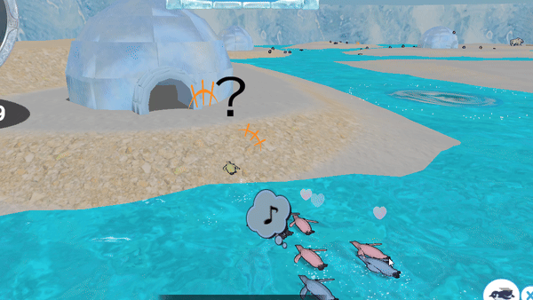

当初、子ペンギンは距離さえ近ければ壁の向こうにいる親にも無条件で寄っていきました。これでは「はぐれた子を探しに行く」という遊びが成立しないため、子が親を**視界と音で察知する**モデルを実装しました。

#### 察知の判定

親を知覚できたかどうかは、次の順で判定します。

1. **距離**：タイプ別の察知距離の内側にいるか
2. **視野角**：子の体の正面（移動方向ではなく `transform` の向き）から見て視野角の内側か
3. **遮蔽**：親との間に地形が挟まっていないか（レイキャスト）

3の遮蔽判定はコストが高いため、**子ごとにスロットをずらして8フレームに1回**だけ撃っています。子が100体でも1フレームあたり最大12.5本で、実際は距離と向きの足切りを通った子だけなのでさらに少なくなります。レイの視点は足元ではなく背丈70に対して**高さ42**から飛ばしています。足元どうしを結ぶと、なだらかな凸斜面でも地面をかすめて「見えていない」と誤判定するためです。

視界に入っていなくても、親のホイッスルや足音が聞こえれば**音だけ先に届きます**。この状態の子は頭上に「？」を出し、その場でゆっくり親のほうへ振り向きます。振り向いた結果、親が視界に入れば「！」を経て寄ってきます。振り向き中は旋回速度を落としているので、プレイヤーには「気づかれるまでの猶予」が生まれます。

#### タイプごとの個性を察知性能で作る

子ペンギンには5タイプありますが、配合比率だけでは実測しても個性が見えていませんでした。そこで**察知性能そのものをタイプ別のテーブル**にして差を付けました。

| タイプ | 察知距離 | 視野角 | 反応の遅さ | 性格づけ |
|---|---|---|---|---|
| まじめ | 420 | 120° | 0.2秒 | 一番よく気づく |
| 甘えん坊 | 360 | 100° | 0.3秒 | 親を探しているので広い |
| やんちゃ | 180 | 50° | 1.2秒 | よそ見をしていて気づかない |
| おっちょこ | 240 | 70° | 0.8秒 | どんくさい |
| 世話焼き | 300 | 90° | 0.4秒 | 標準 |

また、一度でも親を見た子が最後まで追い続けるとステージ中の子が全員集まってしまうため、知覚できない状態が**4秒**続いたら寄るのをやめてその場で待つようにしています。

#### シロクマからの逃走を最優先にする

シロクマに追われている子は、隊列復帰よりも**逃走を優先**します。クマが離れてからも1秒は逃げ続け（0にするとクマの脇をすり抜けた瞬間に立ち止まって不自然になる）、逃げ終わってから2秒は隊列に戻れません。この「集め直す時間」がないと、散った直後にその場で入隊し直してしまい、体験の谷ができませんでした。

逃走方向は1.5〜2秒ごとに選び直し、40%は直進、残りは左右45〜90度の回避にしています。まっすぐ逃げるだけだと群れが一方向に固まってしまうためです。

[⇑目次に戻る](#目次)

---

### 経路探索（歩行可否グリッドとフローフィールド）

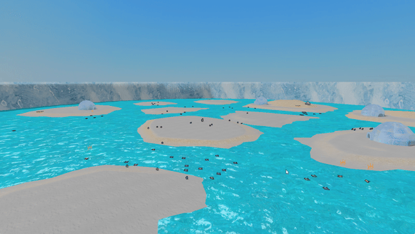

ステージを**流氷原**（水路で分断された氷盤の集まり）へ作り直したことで、直線移動のAIが破綻しました。子ペンギンが絶壁に向かって泳ぎ続けたり、氷盤の縁で挟まったりします。そこで簡易的なナビゲーションとして `StageNavGrid` を実装しました。

#### ハイトマップからグリッドを作る

地形メッシュを生成した直後、**すでに手元にある頂点高さ配列**を約40ワールド単位の粗いセルへ落とし、セルごとに3種類へ分類します。追加のファイル読み込みもレイキャストも行わないため、ロード時間はほぼ増えません。

- **陸**：歩ける
- **水**：泳げる（ペンギンは泳げるので常に通行可能）
- **通行不能**：急斜面

ポイントは**水と陸の行き来を浜（低い陸セル）だけに許す**ことです。これにより「海からは登れない絶壁」がそのまま経路上の壁になり、崖の下で延々ともがく挙動が消えました。

#### 用途によって2つのアルゴリズムを使い分ける

| 用途 | アルゴリズム | 理由 |
|---|---|---|
| 徘徊先の到達性チェック | A* | 1体・1回きりの単発クエリなので、目的地へ向かう探索が速い |
| 親への追従 | ダイクストラのフローフィールド | 目標が1つで探索元が多数。全子ペンギンで1つの場を共有できる |

フローフィールドは目標（親）から全セルへの最短コストと「次に向かうべきセル」を1回で求め、**全ての子がそれを共有**します。1体ずつ経路探索するのに比べて、子の数が増えてもコストが増えません。毎フレームではなく0.5秒間隔で作り直しています。

移動コストは水を陸より安くしてあります。泳ぎのほうが速いため、実際に遠回りでも水路を使ったほうが早く着くケースを正しく選べます。

なお、フローに沿わせるのは**親から十分離れているときだけ**です。隊列スロットの近くまで来たら直進に切り替えます。グリッドは40単位と粗いので、そのまま使うとスロットへの精密な寄せが乱れてしまうためです。

[⇑目次に戻る](#目次)

---

### 初回操作ヒント

遊び方を伝えるためにチュートリアルステージを用意していましたが、本編と別の場所で操作を説明しても覚えてもらえず、かつ本編に入る前に離脱される問題がありました。そこで、**その操作を使うべき状況が初めて発生した瞬間**にボタンアイコンと短文をポップ表示する仕組みへ置き換えました。

| ヒント | 発生条件 |
|---|---|
| Y（よびもどし） | 自分の隊列がシロクマに襲われた |
| LT/RT（ウルト） | ウルトゲージが初めて満タンになった |
| B（そっと歩く） | 寝ているシロクマに近づいた |
| X（すべる） | 下り坂にさしかかった |

表示は全難易度共通で、1プレイにつき各ヒント1回だけです。「操作を知りたくなった瞬間」にだけ出るので、既に分かっているプレイヤーの邪魔になりません。

表示位置は**画面中央上部に固定**しています。当初はヒントを対象キャラクターの頭上に出そうとしましたが、動くものに追従する文字は読もうとして目で追うことになり、映像酔いの原因になります。読ませる文字は画面に固定する、というルールをここで決めました。

なお、この作業中に「そっと歩く」の到達可能距離が実質機能していないことが分かりました。ヒントの発生距離を決めるために実測したところ、走って近づくとシロクマは350前後で起きてしまい、当時の判定距離200には**そもそも到達できなかった**ためです。判定距離を600へ広げ、ヒントの発生距離と揃えました。

このヒントシステムが機能することを確認したうえで、**チュートリアルステージは削除しました**（[開発プロセス・ボツ案](#ボツにした機能)）。

[⇑目次に戻る](#目次)

---

## 5. パフォーマンス最適化・その他機能

### フラスタムカリング

 

※分かりやすくするために、デバッグ用にフラスタムの範囲を狭めています。  
画面外のオブジェクトを描画しないようにするため、**フラスタムカリング**を実装しました。  
ビュープロジェクション行列から6平面を抽出し、AABBやポリゴンとの交差判定を行います。

|フラスタムカリングOFF|フラスタムカリングON|
|---|---|
|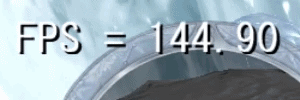|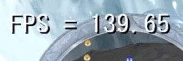|

スポーン直後でFPSを計測しました。  
フラスタムカリングをONにすると、安定して144fpsが出ていますが、OFFにすると140fpsを下回ることが多々あります。

#### 通常モデルの場合
  
静的なモデル（ステージ等）は、**メッシュの頂点座標からワールド空間のAABBを構築**して粗判定し、  
AABBが視錐台と交差している場合は、さらに **トライアングルカリング** によるポリゴン単位の細判定を行います。  
これにより、1つのモデルでも画面に映っているポリゴンだけを描画できるようにしました。  

なお、アニメーションのあるモデルは、**ボーンの座標からワールド空間のAABBを構築**して判定します。  
キャラクターモデルはサイズが小さいためフラスタムを跨ぐことも少なく、スキニングの再計算をするとCPUの負荷が高まるため、  
トライアングルカリングは行っていません。

#### 海の場合

海は1つの巨大なグリッドオブジェクトで構成されています。  
最初からポリゴン単位で判定するとCPUへの負荷が大きすぎるため、**2段階**でAABB判定しています。

1. **チャンク単位のAABB判定**：海を 8×8 のチャンクに分割し、視錐台と交差するチャンクだけを通過させる
2. **セル単位のAABB判定**：通過したチャンクをさらにセル単位で交差判定し、可視セルのみをGPUに送る

チャンクのAABBのY範囲は、コンピュートシェーダーで計算した**波高さキャッシュ**から動的に構築します。  
これにより、CPUとGPUの負荷バランスを適切に保ちながら描画コストを削減しています。

[⇑目次に戻る](#目次)

---

### リソースの非同期読み込み


BeastEngine に **`ResourceManager`** を実装し、  
 - モデル（tkm）
 - スケルトン（tks）
 - アニメーションクリップ（tka）

のファイルIOをワーカースレッドで非同期に実行しています。  
これにより、ロード画面を動かしつつ、裏でリソースの読み込みを行っています。

#### 設計のポイント

ファイルIO（重い処理）はワーカースレッドで行い、  
バンク登録やオブジェクトの初期化（グローバル状態に触れる処理）はメインスレッドで行うという
**スレッドセーフな役割分担**を意識して実装しました。
```
[ワーカースレッド]               [メインスレッド]
ファイルIO（tkmの読み込みなど）  → IsReady() で完了を確認
                                 → Finalize() でバンク登録・初期化
```


同じファイルパスへの2回目以降のリクエストはキャッシュから返るため、**二重IOが発生しない**設計になっています。

#### キャラクターへの適用

`CharacterBase::Update()` 内でロード完了を毎フレーム確認し、完了後に `ModelRender` の初期化を行います。  
ロード完了までの間もゲームループは止まらず、他のオブジェクトは通常通り動作します。

[⇑目次に戻る](#目次)

---

### ディザリング


カメラとプレイヤーの間にオブジェクトがある場合、プレイヤーが見えなくなってしまいます。  
この問題を解決するために、ディザリングによる遮蔽オブジェクトの透過処理を実装しました。

#### 実装の経緯

最初は**スイープテスト**でカメラとプレイヤーの間にあるオブジェクトを検出する方法を試みました。
しかし以下の問題が発生しました。

- オブジェクト全体が半透明になってしまう
- 足元にあるオブジェクトまで半透明になってしまう

#### 解決策：円錐状のレイキャストによるピクセル単位判定

そこで、**カメラからプレイヤーに向かって円錐状にレイを飛ばし、遮蔽されているピクセルだけをピンポイントで透過**する方法に変更しました。

処理はGBufferへの書き込みシェーダー（`RenderToGBuffer.fx`）内で行います。

1. **前後判定**：フラグメントがカメラとプレイヤーの間にあるか判定
2. **円錐内判定**：カメラ→プレイヤー方向の視線から、フラグメントまでの距離が円錐の外側半径以内かを判定
3. **フェード**：内側半径（外側の70%）〜外側半径の範囲で `smoothstep` によるグラデーション
4. **ディザリング**：4×4 Bayerパターンを用いてピクセルを間引き、透過を表現

これにより、プレイヤーと重なっている部分だけをピンポイントで透過でき、不要な半透明化が発生しなくなりました。  
また、ディザリングはGBufferパスでピクセルを `clip()` で破棄するだけなので、**ディファードレンダリングとの相性が良い**という利点もあります。

[⇑目次に戻る](#目次)

---

### 危険矢印UI

 

シロクマに狙われている子ペンギンをプレイヤーに知らせるため、**危険矢印UI**を実装しました。  
ターゲットがカメラのフラスタム内にいるか外にいるかで、矢印の種類と配置を自動的に切り替えます。

#### フラスタム外：edge arrow

ターゲットが画面外にいる場合、**画面中央を基点とした円の縁（半径300px）に矢印を配置**し、ターゲットの方向を指し示します。  
ターゲットのワールド座標をスクリーン座標に変換し、画面中心からの角度を `atan2` で求めて円縁上の座標と回転角を算出しています。

#### フラスタム内：overhead arrow

ターゲットが画面内にいる場合、**ターゲットの真上に下向きの矢印を配置**し、一目でどの子ペンギンが狙われているかわかるようにしました。

#### サブカメラとの連動

どちらのケースでも、最もカメラに近い攻撃対象が `SubCameraManager` を通じてサブビュー（小窓）に映し出されます。  
ただしターゲットが十分近く（距離1000未満）かつフラスタム内にいる場合は、プレイヤーが目視できる状況なのでサブビューを非表示にします。

#### DangerArrowCalcによる定数の一元管理

矢印の配置計算に使う定数（円半径・オフセット・回転角）と計算関数は `DangerArrowCalc.h` に分離しました。  
`DangerArrowSystem` と `TutorialController` の両方がこのヘッダーを参照することで、**チュートリアルの矢印と実戦の矢印が常に同じ位置・角度で表示される**ことを保証しています。

[⇑目次に戻る](#目次)

---

### 足跡デカールとディスクリプタヒープの上限

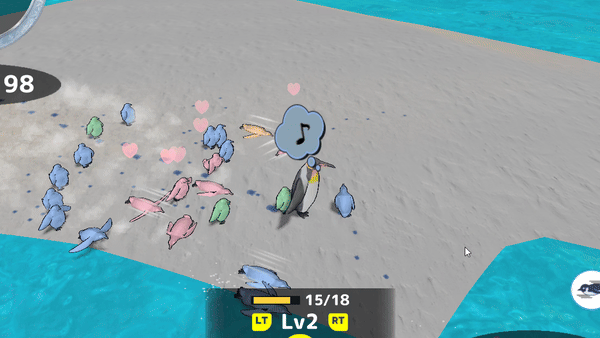

群れが通った跡を残すため、地面に足跡を投影するデカールを実装しました。板ポリ1枚を地形の法線に沿わせて置き、細かい凹凸はシェーダー側でハイトマップをサンプリングして切り抜いています。実装そのものより、**枚数を増やそうとして頭を打った上限**のほうが学びが大きかった機能です。

#### 1. プールを種類ごとに分ける

そもそも足跡が重いと気づいたのは、フレームレートの落ち込みを Visual Studio のパフォーマンスプロファイラで追ったときです。ホットパスを開くと、**CPU時間の約29%が足跡の生成に消えている**ことが一目で分かりました。

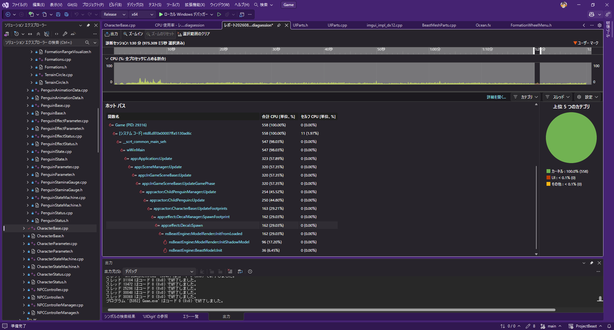

`ChildPenguin::Update` の下の `CharacterBase::UpdateFootprints` が 29.21%、そのほぼ全部が `DecalManager::SpawnFootprint` → `Decal::Spawn` に流れ込み、最終的に `ModelRender::InitFromLoaded`（29.03%）で消費されています。つまり足跡の**描画**ではなく、デカールの**モデル初期化**が犯人でした。

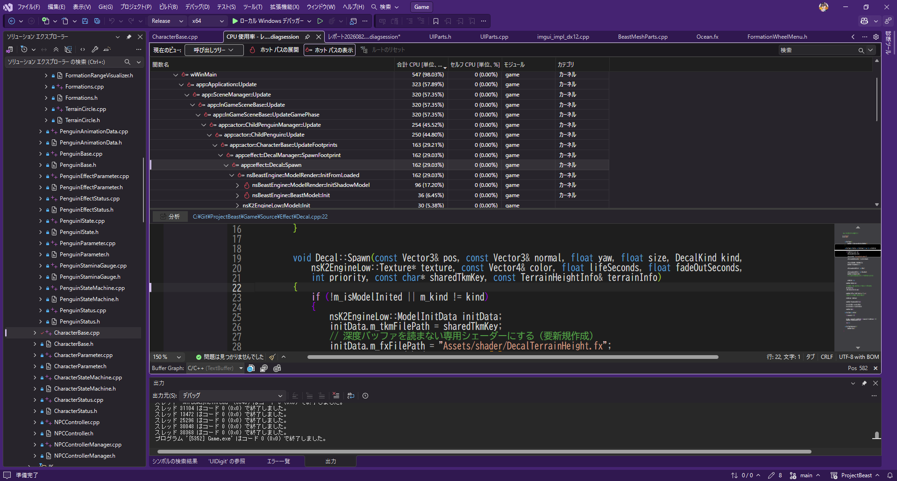

該当箇所まで降りると、`Decal::Spawn` の先頭の再初期化条件 `if (!m_isModelInited || m_kind != kind)` に行き当たります。内訳は `InitShadowModel` が 17.20%、`BeastModel::Init` が 6.45% で、モデルとシャドウモデルを丸ごと作り直しているコストです。

原因はプールの持ち方でした。最初は全種類（雪・草・岩・クマ）で1本の64枚プールを共有していたため、スロットが別の種類に使い回されるたびにこの条件が真になり、`ModelRender::InitFromLoaded` を呼び直していました。**実測で1回あたり約10ms、Normalステージ118秒で314回**発生しています。

種類ごとにプールを分けると「スロットの種類が変わる」こと自体が起きなくなり、作り直しは**スロットごとの初回1回だけ**になります。枚数配分は実測に基づき、子ペンギンの大半が歩く雪面へ厚く割り当てました。

#### 2. 枚数の上限を決めていたのは見た目ではなくヒープ数だった

見栄えを良くするため枚数を増やしたところ、**フィーバータイムでクラッシュ**しました。原因はVRAM不足ではなく、**シェーダー可視ディスクリプタヒープの総数上限**です。

- デカール1枚がヒープを1個占有する
- フィーバー時はゲーム全体で約3590個に達している
- ドライバは**生存4021個の時点で `CreateDescriptorHeap` に失敗**した（≒4096が上限）

つまりデカールに使える枠は100個強しかなく、合計384枚にした時点で上限を超えていました。最終的に**合計104枚**（雪64・草8・岩8・クマ24）で確定しています。これ以上増やすにはヒープを共有するインスタンシング化が必要で、次の課題として残しました。

この上限は仕様書のどこにも書かれておらず、`g_numDescriptorHeapLive` という生存ヒープ数のカウンタをエンジンに追加して初めて見えるようになった数字です。

#### 3. 初期化をロード中に済ませる

デカール1枚の初期化には約8msかかります。プレイ中の初回スポーンに任せると、その瞬間にヒッチが出ます。かといってロード時に一括初期化すると約2秒フレームが止まります。

そこでロードフェーズに `DecalPrewarm` を追加し、**1フレーム6枚ずつ**全スロットを事前初期化するようにしました。ロード画面のアニメーションを止めずに、プレイ中のヒッチも消せます。

#### 4. 見えない原因は濃さではなく色だった

枚数を増やしても足跡が見えず、当初は不透明度や枚数の問題だと考えていました。実際の原因は**色**で、流氷原の淡い氷面に対して足跡も淡色だったため、地面に完全に溶けていました。濃い青へ変更したところ、枚数はそのままで一気に視認できるようになりました。生存時間3.5秒・フェードアウト1秒で、群れの軌跡が尾を引くように見えます。

[⇑目次に戻る](#目次)

---

### ロード時間の短縮（時分割ロードとシェーダーキャッシュ）

ステージ開始時にロード画面が**5〜6秒フリーズ**し、ローディングアイコンのアニメーションまで止まるため、ハングしたように見える状態でした。

#### まず犯人を特定する計測を入れる

ロードはフェーズ分けされたステートマシンで進むため、**1フレームの処理時間が50msを超えたフェーズだけ**をフェーズ名つきで `Logs/load_trace.txt` へ記録するようにしました。推測せずに済むよう、最初に計測を用意しています。

これで犯人が判明しました。

| 原因 | 一括実行時のコスト |
|---|---|
| シェーダーの実行時コンパイル | 1シェーダーあたり数百ms |
| 地形の初期化 | 約1.5秒 |
| ミニマップアイコンの生成 | 約1.3秒 |
| BGMの初回再生（16MBの同期読み込み） | 約1.3秒 |
| デカールの事前初期化 | 約2秒 |

#### 対策1：シェーダーのディスクキャッシュ

コンパイル済みバイトコードを `ShaderCache/` へ保存し、次回以降は実行時コンパイルを丸ごとスキップします。キャッシュの有効性は **`Assets/shader` 以下すべての最終更新時刻の最大値**で判定しています。fx本体のmtimeだけを見るとincludeヘッダーの編集を検知できないため、フォルダ全体で見る方式にしました。

これにより「.fxを直して再起動するだけで反映される」という開発フローを壊さずに済んでいます（シェーダーを1つでも編集すると全キャッシュが自動的に無効化されるため）。

なお、後日のコードレビューで**書きかけのキャッシュを読んでしまう欠陥**が見つかりました。初回起動中にプロセスを終了させると中途半端な `.cso` が残り、次回以降それを読んでパイプラインステートの作成に失敗し、`ShaderCache/` を手で消すまで起動できなくなります。ヘッダーにバイトコードのサイズを持たせて読み込み時に照合し、保存は一時ファイルへ書いてから差し替える方式に修正しました。

#### 対策2：重い初期化を時分割ステートマシンにする

地形の初期化を、1フレームあたり50ms以下に収まる単位へ分割しました。

1. ハイトマップ・スプラットマップの読み込み
2. メッシュ生成
3. **テクスチャを1フレーム1枚ずつ**読み込む（1枚約40ms・全11枚）
4. 物理コリジョンの構築
5. **チャンク別のModelRenderを25msの時間予算内で数個ずつ**初期化

同じ考え方でミニマップアイコンも1フレーム16個ずつ生成しています。BGMは、ロード開始と同時に**別スレッドでファイル読みだけを済ませて**OSのファイルキャッシュに載せておき、本番の同期ロードがキャッシュヒットになるようにしました。

#### 結果

フリーズは5〜6秒から**最大510ms**（実測）まで下がり、ローディングアイコンが最後まで回り続けるようになりました。ロード時間の合計自体はほぼ変わっていませんが、「止まっている」のか「進んでいる」のかがプレイヤーに伝わる状態になっています。

[⇑目次に戻る](#目次)

---

### GPUデバイスロストの原因調査（DRED）

統合作業中、**2周目以降のステージで必ずクラッシュする**問題が発生しました。厄介だったのは、落ちる場所が毎回違うことです。

| 現象 |
|---|
| `DescriptorHeap::Commit` でabort |
| フィーバー開始時に `OceanMesh::DispatchWaveCS` でアクセス違反 |
| ステージ開始直後に `IndexBuffer::Copy` でアクセス違反 |

いずれも**デバイスロストの巻き添え**で、GPUが死んだ後に触ったAPIがそれぞれの場所で失敗していただけでした。落ちた場所を追っても原因には辿り着きません。

#### 調査基盤を先に作る

そこでDirectX 12の **DRED（Device Removed Extended Data）** を使った調査基盤を実装しました。

| 何を | 内容 |
|---|---|
| DREDの常時有効化 | デバイス作成**前**に auto-breadcrumbs / page fault / breadcrumb context を有効化 |
| デバイスロストレポート | 理由コード・VRAM使用量・**全コマンド履歴（命令名つき）**・ページフォルト情報をファイルへ書き出す |
| Mapガード | 各種バッファのMap失敗時に、即死せず必ずレポートを書く |
| フレーム毎の検知 | `BeginRender` / `EndRender` で `GetDeviceRemovedReason` をチェック |
| パス名・モデル名マーカー | 描画パス名とモデル名をコマンドリストへ刻み、DREDのパンくずに残す |
| 自動プレイ | 環境変数で全難易度を無入力周回するソークテストモード |

#### レポートから原因を絞り込む

出力されたレポートは次を示していました。

- 理由は `DXGI_ERROR_DEVICE_HUNG`（TDRタイムアウト）。**VRAMは3.9/7.2GBで枯渇ではなく**、ページフォルトの記録もない
- ハング地点はフォワードパスの連続ドローの途中
- そして決め手が、**そのドロー列にモデル名マーカーが付いていない**こと

モデル描画には必ずマーカーを刻んでいるので、マーカーの無いドロー＝`ModelRender` を経由しない描画、つまり**デカール**だと特定できました。

#### 原因と修正

デカールはモデル初期化時に**そのステージの地形ハイトマップのSRV**をバインドします。ところが再初期化の条件が「未初期化 or 種類違い」だけだったため、プロセス寿命を持つプールがステージ2以降も**破棄済みテクスチャのSRVを握ったまま**描画していました。GPUが解放済みメモリを読み、TDRに至っていたわけです。

皮肉なことに、これは前述の**プール分割の副作用**でした。分割前は種類が切り替わるたびに再初期化が走っていたため（1プレイ314回）、偶然SRVが張り直されて問題が隠れていたのです。

修正は、地形情報に**世代番号**を持たせ、世代が変わっていたら種類が同じでも再初期化する方式にしました。ポインタ比較ではなく世代番号にしたのは、解放されたアドレスが再利用されると同一と誤判定し得るためです。あわせて、シーン破棄時に**地形の破棄より前に**全デカールを止める処理を追加しました。

この調査の過程で、`ChildPenguinManager` のデストラクタが生存中の子ペンギンを解放しておらず、**1周ごとに最大164体分のリソースがリークしていた**バグも見つかりました。1起動1ステージの運用では発覚しなかった、プロジェクト初期からのバグです。

計測基盤はそのまま残していますが、マーカーの発行は毎ドローのコストになるため、後日のレビューで環境変数による切り替えに変更しました。

[⇑目次に戻る](#目次)

---

## 6. 開発プロセス・ボツ案

### 未使用機能

実装はしていますが、今作では使用していない機能です。

#### リムライト

`DeferredLighting.fx` 内に実装されており、ディレクションライトの計算結果に加算する形で組み込まれています。  
現在は強度パラメータを調整することで無効化しています。

#### トゥーンシェーディング（陰の段差）

`toon.fx` として実装されており、陰の段階数・閾値・段ごとの色を個別に設定できます。`ModelRender` の設定でモデル単位に有効化できますが、陰がくっきり段になる見た目が今作の絵本調のアートスタイルに合わなかったため、使用していません。

なお、当初は輪郭線もこのトゥーン機能の一部で、**トゥーンを有効にしないと輪郭線も使えない**構造でした。輪郭線だけは視認性の面で必要だったため、後から本体の描画経路から切り離しています（[キャラクターのアウトライン](#キャラクターのアウトライン)）。そちらは実際に使用しています。

### ボツにした機能

#### チュートリアルステージ

本編とは別に、専用ステージで操作を順に説明するチュートリアルを実装していました。ステージ内の各所に解説ウィンドウを置き、かまくら・シロクマ・渦潮・子ペンギンの各タイプへ近づくと説明が出る作りです。

しかし試遊で次の問題が見えてきました。

- 本編と別の場所で説明されても操作が身につかない
- チュートリアルの途中で飽きて、本編へ入る前に離脱される
- 説明を読むためにゲームが止まるので、テンポが悪い

そこで「教えてから遊ばせる」のではなく「**遊んでいる最中に、必要になった瞬間だけ教える**」方針へ切り替え、[初回操作ヒント](#初回操作ヒント)を実装しました。ヒントが機能することを確認したうえで、チュートリアルステージは専用シーン・進行制御・解説ウィンドウ・専用アセットごと削除しています。

なお、タイトルとポーズメニューから開ける「あそびかた」のルール説明画面は別機能なので、こちらは残しています。

[⇑目次に戻る](#目次)
